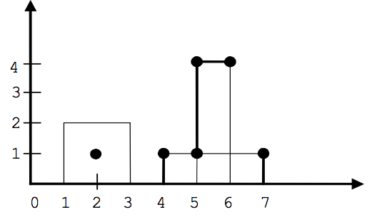

## 문제

IPSC Secondary 9등에 빛나는 정보영재, 윤지용의 취미가 사진찍기인 것은 잘 알려진 사실이다. 지용이는 하늘에 있는 N개의 별을 찍기 위해 카메라를 꺼냈다.

지용이가 가지고 있는 카메라는, 가로 세로 비율에 상관없이 넓이 A인 직사각형 모양의 사진을 항상 찍을 수 있다. 또한, 편집을 편리하게 하기 위해서, 지용이가 찍는 직사각형 형태의 사진은 좌표축에 평행해야 하고, x축과 밑변이 붙어있어야만 한다.

N개의 별은 정수 좌표 (x, y)로 대표되는데, 지용이는 최소의 사진 개수를 사용하여 주어진 모든 별을 찍고 싶어한다. 최소의 사진 개수를 출력해주자.

## 입력

첫 번째 줄에 별의 수 N과, 사진의 넓이 A가 주어진다. A는 정수이다. (1 ≤ N ≤ 100, 1 ≤ A ≤ 200,000)

이후 N개의 줄에 별의 좌표 (x, y)가 정수로 주어진다. 두 점이 같은 좌표를 가지지는 않는다. (0 ≤ x ≤ 3,000,000, 1 ≤ y ≤ A)

## 출력

찍어야 하는 최소의 사진 개수를 출력한다.

## 힌트

