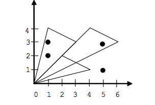

## 문제

양의 정수를 좌표로 갖는 점 K개와, 한 점은 원점, 다른 두 점은 음이 아닌 정수를 좌표로 갖는점으로 이루어진 M개의 삼각형이 주어진다.

이때, 각각의 삼각형의 내부에 주어진 K개의 점 중 적어도 하나는 있는지 없는지 구하는 프로그램을 작성하시오.

## 입력

첫째 줄에 K와 M이 주어진다. 둘째 줄부터 K개의 줄에는 각 점의 x좌표와 y좌표가 공백으로 구분되어 주어진다. 다음 M개의 줄에는 삼각형의 원점이 아닌 꼭짓점의 좌표가 (x1, y1), (x2, y2)가 순서대로 공백으로 구분되어져서 주어진다.

1 ≤ K, M ≤ 100,000

1 ≤ K개 점의 좌표 ≤ 109

0 ≤ 삼각형 꼭짓점 좌표 ≤ 109

삼각형의 넓이는 0이 아니다.

## 출력

M개의 줄을 출력한다. i번줄에는 i번째 입력으로 주어진 삼각형의 내부에 점이 적어도 1개 있으면 Y를, 아니면 N을 출력한다.

## 힌트

