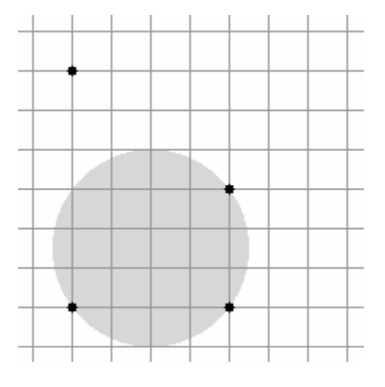
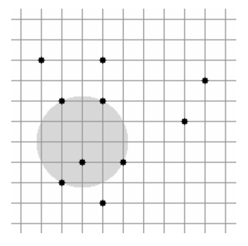

## 문제

A telecom company is developing a GSM network in the city of Vrsar. Their contract with the city specifies the minimum number of households that need to be covered by the signal. Due to budget constraints they can only build one antenna with a certain range. Since the cost is proportional to the range of the antenna, they would like to place the antenna so that the range required to meet the terms of the contract is minimized.

There are N households in Vrsar, each represented by a pair of integer coordinates. The antenna can be placed at any point in the plane (not necessarily with integer coordinates) and the range of the antenna can be any positive real number. If the range of the antenna is R, then a household is covered by the signal if the distance between the antenna and the household is at most R.

Write a program that, given the locations of the households and an integer K, finds the minimum range required and one possible location for the antenna so that at least K households are covered by the signal.

## 입력

The first line of input contains two integers N and K (2 ≤ K ≤ N ≤ 500) – the total number of households and the minimum number of households that need to be covered by the signal.

Each of the following N lines contains two integers X and Y (0 ≤ X, Y ≤ 10 000) – the coordinates of one household. No two households will be located at the same coordinates.

## 출력

The first line of output should contain the minimum required range R for the antenna – a real number.

The second line of output should contain the coordinates of the antenna – two real numbers X and Y. Note:

If there are multiple solutions, you should output any one of them. All three numbers should be output either in standard decimal form or scientific notation.

Your solution will be marked correct if and only if the following two conditions are satisfied:

* The absolute difference between R and the minimum required range as determined by the jury is less than or equal to 0.0001.
* The antenna with range R+0.0002 placed at coordinates (X, Y) covers at least K households.

## 힌트

