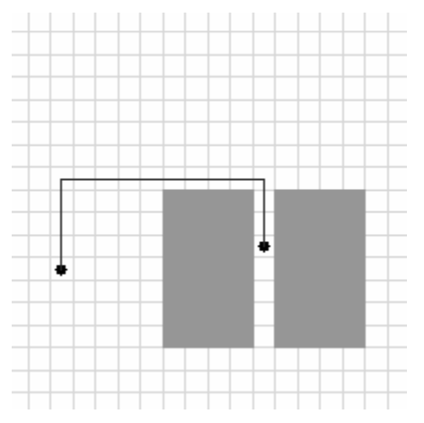
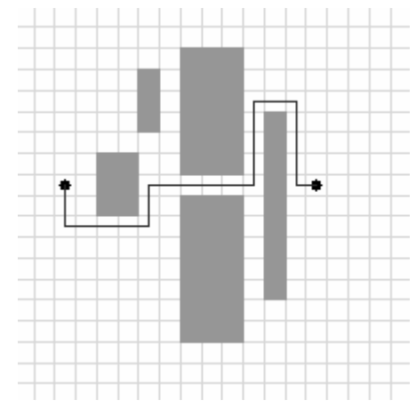

## 문제

Finding your destination in a big unknown city can be challenging, especially if you are a computer scientist like Kirk, always trying to use the shortest possible path. Planning can help – given the map of the city Kirk wants to find the shortest path between his current position and his destination.

The map of the city can be represented in the plane as an infinite grid composed of unit squares.

Kirk is currently located at the square (0, 0) and his destination is the square (X, Y).

There are N buildings in the city. Each building is a rectangle fully occupying a number of unit squares. No two buildings touch or overlap, i.e. Kirk can walk freely around every building. A building is defined by specifying the coordinates of two diagonally opposite squares occupied by the building.

In each step, Kirk can walk to one of the four neighboring squares, but he is not allowed to step onto a square occupied by a building. His current position is at the west entrance to the city and the x coordinate of every square occupied by a building is strictly greater than zero.

Write a program that, given the locations of the buildings, finds one shortest possible path from Kirk's current position to his destination. A path should be reported as a sequence of vertical and horizontal segments, with no two consecutive segments parallel. The length of a path is the number of squares contained in the path, excluding the initial square.

## 입력

The first line of input contains two integers X, Y (1 ≤ X ≤ 106, -106 ≤ Y ≤ 106) – the coordinates of the destination square. The second line of input contains a single integer N (0 ≤ N ≤ 100 000) – the number of buildings in the city. Each of the following N lines contains four integers X1, Y1, X2, Y2 (1 ≤ X1, X2 ≤ 106, -106 ≤ Y1, Y2 ≤ 106) – the coordinates of two diagonally opposite squares occupied by the building.

## 출력

The first line of output should contain an integer L – the length of the shortest path to the destination.

The second line of output should contain an integer M – the number of segments in the shortest path. The number of segments M must not exceed 1,000,000.

Each of the following M lines should contain two integers, DX and DY, describing Kirk's relative movement in one segment. For each segment, exactly one of the values DX, DY should be zero, and no two consecutive segments should be parallel.

Note: if there are multiple solutions, you should output any one of them.

## 힌트

