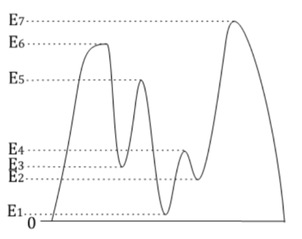
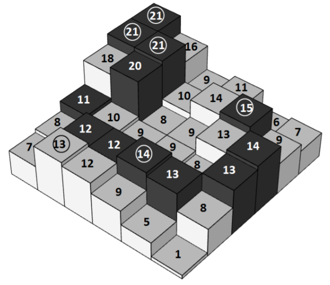

## 문제

An alpinist who lives on a mountainous island has climbed to some peak and now wants to reach a higher peak.

To be more precise, every point on the island has a positive elevation above sea level (the elevation of the sea is 0) and if the peak the alpinist is currently on has elevation Ei, then his aim is to reach some peak with elevation Ej(Ej>Ei). Because he is on a peak there is no immediate path uphill – to get to a higher point the alpinist first needs to go downhill to some lower level and only then he can go uphill again. The way down is never as remarkable as the way up, thus, the alpinist wants to maximize the elevation of the lowest point on the path from the current location to the higher peak.

For example, if the profile of the island is as shown in the figure and the alpinist is at the peak with elevation E4, then there are three peaks with higher elevation (E5, E6 and E7), but the path with the lowest point having the highest elevation is the path to the peak with elevation E7 – on this path he never goes below level E2 (in the other cases he will be forced to go down to level E1). If he started from E5, the corresponding lowest level would be E3 (path to E6), but if he started from E6 it would be E1.

The map of the island is a two-dimensional rectangular table containing N×M squares and it describes the elevation of particular parts of the island – the number in a cell describes the elevation of the corresponding region of the island. Two cells are adjacent if they share a common point. Thus, each cell (except those on the border) is adjacent to eight other. A path is a sequence of cells where each two consecutive cells are adjacent. A flat area is a set of one or more cells having the same elevation, any pair of them being connected by a path only visiting cells within the set. Any two adjacent cells with equal elevation belong to the same flat area. A peak is a flat area whose cells don’t have any adjacent cells with higher elevation.

Write a program which finds all peaks on the island and for each of them finds the elevation of the highest possible lowest point on a path to some peak with a higher elevation. For the highest peak on the island (for which there is no higher peak on this island) we assume that the alpinist will leave the island looking for higher peaks, thus, the lowest point will be 0 (the level of the sea).

## 입력

The first line of input contains two positive integers N and M (1≤N,M≤2000, N×M≤105), the height and the width of the map, respectively. The next N lines contain the description of the map of the island. Each of these lines contains M integers Eij(1≤Eij≤106) separated by spaces. The elevation of the cell Eij (corresponding to i-th row and j-th column on the map) is given as the j-th number in the i+1-st line of the file.

## 출력

The first line of output must contain one integer P, the number of peaks found on the island. The next P lines must each contain two integers: the elevation of the particular peak and the elevation of the highest possible lowest point on the path to some higher peak. The information about peaks should be written in descending order of their elevation; if several peaks have the same elevation then they should be sorted in descending order of the lowest point elevation.

## 힌트

All peaks are marked by circles. One of the possible paths from peak with elevation 15 is shown with dark colouring.
