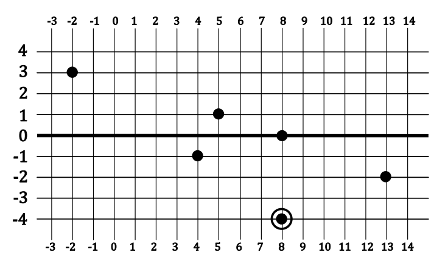

## 문제

In the city of RightAngleles streets are built as an infinite square grid – any two of them are either parallel or perpendicular to each other and the distance between two nearest parallel streets is the same (let’s denote this distance as one unit). All streets that are oriented in West-East direction are called horizontal streets and are numbered by consecutive integers in South-North direction. All streets that are oriented in South-North direction are called vertical streets and are numbered by consecutive integers in West-East direction.

Every citizen lives in a house with entrance located at one particular horizontal and vertical street intersection. There may be several citizens living in the same house.

Mayor of RightAngleles would like to brush up his popularity by organizing a fireworks display at an intersection of the main horizontal street (labelled with number 0) and some vertical street. It is known where the citizens interested in coming and enjoying the fireworks live. Fireworks will be seen along both streets at which intersection the display will take place; furthermore, due to safety reasons during the display observers must be at least S units away from the intersection from which the fireworks are launched. Thus, if the fireworks will be launched from the intersection with vertical street V, then every interested citizen must come to an intersection on the main horizontal street (with number 0) or the vertical street V no closer than S units from the intersection of the main horizontal street and vertical street V. For example, if S=2, then observing may be done from any intersection on the main horizontal street, except the ones that intersect with streets V-1, V, and V+1, and from all intersections on the vertical street V, except the ones that intersect with horizontal streets -1, 0, and 1.

The overall positive influence of fireworks is strongly related to the total distance which citizens need to move to observe the display. Therefore, the intersection for the fireworks must be chosen in a way to minimize this total distance.

For example, if S=2 and there are seven citizens whose locations are shown on the map (there are two of them in (-4;8)), then the best place for the fireworks is the main street intersection with 8th vertical street; in this case the total distance which citizens need to move is 9 units.

Write a program which calculates the minimum possible total distance (in units) which citizens have to move to observe the fireworks.

## 입력

Input data is given in standard input. The first line contains two positive integers separated by spaces: the number of citizens N (N≤105) and the safety distance S (S≤106) in units. The next N lines contain the descriptions of the locations of citizens. Each of these lines contains two integers Hi and Vi separated by a space; Hi and Vi (-109 ≤Hi,Vi≤109) denote the numbers of the horizontal and vertical street, respectively, of the intersection where the entrance to the i-th citizen’s house is located.

## 출력

The first and only line of output must contain exactly one integer – the minimum total distance (in units) which citizens must move to observe the fireworks.
