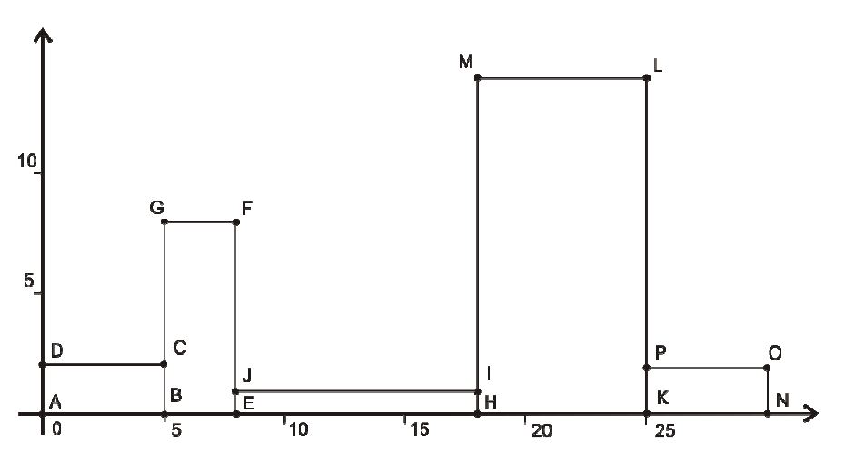

## 문제

n 개의 사각형이 주어진다. 사각형에는 1 부터 n 까지 번호가 주어진다. 아람이는 x축 위에 이것들을 번호 순서대로 왼쪽에서 오른쪽으로 밀착시켜서 붙이려고한다. 그림에서 보이듯이 각 사각형은 짧은 변 혹은 긴 변이 바닥에 붙도록 놓여진다. 아람이는 이 사각형의 위쪽의 둘레가 가장 긴 경우가 되도록 사각형을 놓으려고 한다. 위쪽의 둘레라는 것은 x축과 붙어있는 바닥과 양옆 사이드 변의 길이를 제외 한 것을 말한다.

사각형들의 위쪽 둘레가 가장 길어지는 경우의 위쪽 둘레의 길이를 계산하는 프로그램을 작성하시오.

## 입력

첫 번째 줄부터 표준입력으로 들어온다. 첫 번째 줄에는 사각형의 개수 n이 주어진다. 다음 줄부터 n개의 줄에 ai 와 bi가 주어진다. ai와 bi는 사각형의 두 변의 길이이다. (0 < n < 1000; 0 < ai < bi < 1000)

## 출력

양수 정수로 최대 위쪽 둘레를 출력한다.

## 힌트

위의 그림은 주어진 예제의 사각형을 위쪽 둘레가 최댓값이 되도록 배치한 모습이다.

위쪽 둘레가 포함하는 변은 DC, CG, GF, FJ, JI, IM, ML, LP, PO 이다. 그래서 총 길이의 합은 68이 된다.
