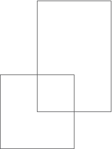

## 문제

2051년, 야심차게 발사한 화성탐사선 성화가 탐사한 곳의 화성 지도를 N개 보냈다.

화성탐사선의 성공에 의기양양해진 BaSA(Baekjoon Space Agency)는 야심찬 계획을 발표했다.

화성 전체 지도를 만들겠습니다!

전체 지도를 만들기 전에, 지금까지 화성탐사선이 보낸 지도를 모두 합쳤다. 이때, 이 지도의 크기는 몇일까?

탐사선이 보낸 지도는 항상 직사각형 모양이며, 겹칠 수도 있다.

## 입력

첫째 줄에 화성탐사선 성화가 보낸 지도의 수 N(1 ≤ N ≤ 10,000)이 주어진다. 다음 N개의 줄에는 각 지도의 정보가 주어진다. 지도의 정보는 네 정수 x1, y1, x2, y2 (0 ≤ x1 < x2 ≤ 30,000, 0 ≤ y1 < y2 ≤ 30,000)으로 이루어져 있다. (x1, y1)와 (x2, y2)은 직사각형의 왼쪽 아래 좌표와 오른쪽 위 좌표이다. 모든 지도는 직사각형이고, 변은 항상 x축과 y축에 평행하다.

## 출력

첫째 줄에 지금까지 탐사선이 보낸 지도를 모두 합쳤을 때, 그 면적을 출력한다. (직사각형을 모두 합쳤을 때 면적)

## 힌트

