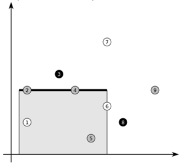

## 문제

Arsen Lupin, the master thief, aims to steal Evil Erwin’s jewels. Erwin has n jewels on display in his store. Every precious stone is of one of k distinct colors. The exposition is so large that we can treat it as the Euclidean plane with the jewels being distinct points. The display is secured by some quite expensive alarms.

Lupin has invented a device: a big, robotic hand that can grab some of the Erwin’s jewels without triggering any of the alarms. The hand can make one (and only one) grab, taking all the jewels lying on some horizontal segment or below it (see the picture). Lupin could easily take all the jewels this way, but he knows that the more he takes, the harder it will be to get rid of them. He decided that the safest way is to take a set of jewels that does not contain all the k colors.

The robotic hand grabs jewels 1,2,4,5 and 6, carefully omitting the black ones

Compute how many jewels Lupin can steal with one grab of his device, without taking jewels in every color.

## 입력

The first line of the input contains the number of test cases T. The descriptions of the test cases follow:

Each test case starts with two integers n (2 ≤ n ≤ 200 000) and k (2 ≤ k ≤ n) denoting the number of jewels and the number of distinct colors. The next n lines denote the jewels’ positions and colors. The j-th line contains three space-separated integers xj , yj , cj (1 ≤ xj , yj ≤ 109, 1 ≤ cj ≤ k) meaning that the j-th jewel lies at coordinates (xj , yj) and has color cj.

You may assume that there is at least one stone of every color at the exposition.

## 출력

Print the answers to the test cases in the order in which they appear in the input. For each test case print a single line containing the maximum possible number of stolen jewels.
