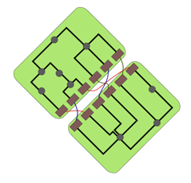

## 문제

In Byteland, there are two leading video card manufacturers: Bitotronics and 3D-Bytes. Their top-of-the-line cards are quite similar. Each of them consists of many nodes, connected with wires transferring the signal that is being processed. The products contain two kinds of nodes: sockets and processors. The wire network fulfills the following conditions:

* Each socket is connected to exactly one processor and no other sockets.
* Each processor is connected to at least two other nodes.
* For any two nodes in the network, there is exactly one path of wires connecting them. In other words, the graph of connections between nodes is a tree.

Bitthew loves to tinker with computer hardware. He has bought two video cards, one from each manufacturer. Since accidentally the cards have the same number of sockets, he has decided to connect each socket of the Bitotronics card to a distinct socket of the 3D-Bytes card with cables. The device he obtained looks like this:

Bitthew would like to squeeze out maximum processing power from the device. In order to do that, he wants to find a path through wires and cables that the processed signal can take. The path should visit each node of both cards exactly once, and it should start and end at the same node on the same card. Help Bitthew find out whether this can be done.

## 입력

The first line of the input contains the number of test cases T. The descriptions of the test cases follow:

Each test case starts with three integers k, n, m (2 ≤ k ≤ 1 000, 1 ≤ n, m ≤ 1 000) denoting respectively the number of sockets on each card, the number of processors on the Bitotronics card, and the number of processors on the 3D-Bytes card. The nodes on the cards are named as follows:

* the sockets on the Bitotronics card: AS1, AS2, . . . , ASk
* the processors on the Bitotronics card: AP1, AP2, . . . , APn
* the sockets on the 3D-Bytes card: BS1, BS2, . . . , BSk
* the processors on the 3D-Bytes card: BP1, BP2, . . . , BPm

The next n + k − 1 lines contain the description of the wire network on the Bitotronics card. Each of these lines contains the names of two different nodes on that card that are connected directly by a wire. The description is followed by a blank line. The next m + k − 1 lines contain the description of the wire network on the 3D-Bytes card in the same format. The description is followed by another blank line. The last k lines of the test case describe the cables added by Bitthew. Each of these lines contains the names of two sockets on different cards that are directly connected by a cable. Every socket will be present on exactly one of these k lines. There is a blank line after each test case except the last one.

## 출력

Print the answers to the test cases in the order in which they appear in the input. For each test case print a single line containing the answer. If there exists no path with the desired properties, output NO. Otherwise, output YES followed by a description of the path: n+m+2k distinct nodes in the order in which the signal will pass through them. Every two consecutive nodes should be connected by a wire or a cable. Additionally, the first and the last node must be connected.
