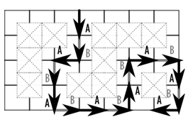

## 문제

Have you ever read any description of some encryption algorithm? These descriptions almost always include messages being sent between Alice and Bob. We (the people organizing the 2011 Central Europe Regional Contest) think that those descriptions are too impersonal — considering these two people are probably the most famous cryptographers in the whole world, we know so little about them. They deserve more attention, don’t you think? We can learn about their hobbies, for instance.

In their free time, Alice and Bob like to play a game inspired by Tron. In this game, you race a car through a square grid and you need to avoid hitting obstacles placed in the grid. Furthermore, the car leaves a permanent trail, which you also need to avoid. The car only moves in the four cardinal directions (east, west, north, or south). In their version of the game, Alice and Bob alternate in controling the car—Alice starts, moves the car from its initial position to one of the adjacent positions in the grid, then Bob takes over and moves the same car to another adjacent position, etc.

The player who crashes the car (i.e., moves it to a position occupied by an obstacle, or to one of the previously visited positions) loses. Both Alice and Bob are incredibly skilled players and never make mistakes; in particular, they only crash if there is no possible move from their current position that would avoid it. Given the map of the obstacles, your task is to determine which player wins from which initial position.

## 입력

The input contains descriptions of several game fields. The first line of each description contains two integers N and E (1 ≤ N,E ≤ 100) — the size of the grid in the north-south and in the east-west directions. The following N lines describe the map. Each of the lines contains a string of E characters, where the j-th character on the i-th line determines the state of the position with coordinates (j,i). The possible characters are “.” (a dot) if the position is empty and the uppercase letter “X” if there is an obstacle. All positions not covered by the map (i.e., with coordinates (j,i) such that i ≤ 0 or j ≤ 0 or i > N or j > E) are forbidden and not used in the game, they work as if there were obstacles.

The last game field is followed by a line containing two zeros.

## 출력

For each game field, output N lines of strings of length E, showing whether Alice or Bob wins when the game starts from the given location. The j-th character on the i-th line should be “A” if Alice wins when starting from the position (j,i), “B” if Bob wins, or “X” if the position contains an obstacle.

After each output, print one empty line.
