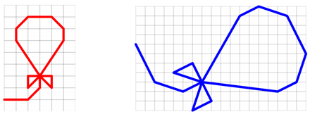

## 문제

Steganography is a special way to protect messages — instead of encryption, the message is somehow hidden. Historically, it was quite a popular technique, but nowadays it is superseded by ciphers, especially those based on keys. However, sometimes it may still be in use. One of the digital steganographic techniques is to hide small pieces of information into a digital image. The image modification is so small that it cannot be spotted by a human eye, but the information (such as a text message) is there and readable by computers. Your task is to compare two images and find such (possibly small) differences.

In this problem, we will focus on vector pictures. Your program is given two pictures and it should decide whether they contain the same image. Geometrically speaking, decide whether the two picture are similar, that means whether they can be transformed into each other using translation, rotation, and uniform scaling (but not mirroring). An example of two similar pictures follows.

## 입력

The input file consists of several test cases, each of them containing two vector pictures. Each picture is described by a sequence of instructions for a plotter device, one instruction per row. Every instruction begins with an uppercase letter followed by one space character and two integer coordinates separated by another space. The letter is either “L” (draw a line) or “M” (move without drawing). The coordinates specify the place to which the line is to be drawn or the current position moved. Coordinates are always given relatively to the end position of the previous instruction. The first instruction is relative to some (unspecified) starting point.

The last instruction of each picture is followed by a row containing the letter “E” (end) and an empty line. The last test case will be followed by a row containing the letter “Q” (quit).

The number of instructions for any picture is between 0 and 1000, inclusive. No instruction has both coordinates equal to zero. The absolute value of all (relative) coordinates is at most 1000.

## 출력

For each test case, print one line containing either the word “YES” (two pictures are similar) or “NO” (pictures are not similar).
