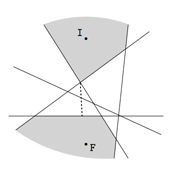

## 문제

The Fiery Beast and the Ice Beast are relicts of the early days of Ardenia. They live in their lairs and they are kept in the lairs’ neighborhoods by powerful magic lines drawn by the Elders. These lines must not be crossed by the beasts. However, in the recent years some of these lines vanished. And if the beasts came too close to each other, the consequences for the whole human race would be catastrophic.

You, the king of the land, are certainly worried about it and gathered all the information about the existing magic lines. It appears that the land can be treated as an infinite plane (this fact was established by Herman the Wise, who traveled for many days in one direction and was still able to see new things!) The lair of the Ice Beast is at point (0, 1010) and the lair of the Fiery Beast is at point (0, −1010). There are several magic straight infinite lines and neither Fiery nor Ice Beast can cross any of it. You want to know what is the minimum distance which always separates the beasts.

An example is presented below. I and F denote the beasts’ lairs and the gray regions denote the areas on which they may freely walk. Dotted segment corresponds to the minimum distance between these areas.

The input contains several test cases. The first line of the input contains a positive integer Z ≤ 20, denoting the number of test cases. Then Z test cases follow, each conforming to the format described in section Input. For each test case, your program has to write an output conforming to the format described in section Output.

## 입력

The first line of the input instance contains one positive integer n ≤ 2 · 105, being the number of magical lines. Each of the next n lines contains three space-separated integers a, b, c, such that −109 ≤ a, b, c ≤ 109 and b ≠ 0. These numbers denote the magic line ax + by + c = 0.

## 출력

You should output a single line containing one number, being the square of the minimum distance between beasts. Your result is going to be accepted if and only if it is accurate to within a relative or absolute value of at most 10-5.
