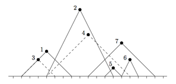

## 문제

It is a well-known fact that all mages wear pointed hats. However, contrary to popular belief, mages do not sleep in them, and those of the Unheard University hang them on one common, very large wall before going to bed. Mages’ hats come only in two shapes: a wide one and a narrow one.

The mages go to sleep one after another (it is easily assured as due to a tight budget, they have only one bathroom and one towel). Before going to bed, the i-th mage takes its hat and chooses an arbitrary position (xi, yi) on the wall, where yi is the (positive) distance from the ground. Then he hammers a nail at position (xi, yi) and hangs his hat on this nail.

Not surprisingly, the hats are magical, which means that they magically unfold to a given height. Hence, when hung, a hat looks exactly like a isosceles triangle of height yi , i.e., its left and right edges are of equal length. Its top vertex is exactly at the nail and its bottom edge touches the floor. If the hat is narrow, then the length of its bottom edge is yi; if it is wide, it is equal to 2yi.

All nails are provided by the university and they have nice heads which glow in the dark. If a nail becomes covered by a hat hung later (even by its boundary), its glow is no longer visible. Moreover, if a mage tries to hammer a nail at an already hanging hat (also even at its boundary), this nail and his hat are thrown away, and he himself becomes expelled from the university. The Chancellor of the University (apparently not having more important things to worry about) wants to know how the number of visible glowing nail heads changes in time.

An example consisting of 7 hats is presented below. Dots correspond to glowing nail heads; numbers represent the order in which they are hung. Hats 2 and 6 are narrow, the remaining ones are wide. Mages 3 and 4 were expelled while trying to hang their hats (their hats were not hung). After mage 7 hung his hat, hats of mages 1, 2 and 7 were visible.

The input contains several test cases. The first line of the input contains a positive integer Z ≤ 30, denoting the number of test cases. Then Z test cases follow, each conforming to the format described in section Input. For each test case, your program has to write an output conforming to the format described in section Output.

## 입력

The first line of the input instance contains n ∈ [1, 105], the number of mages. The i-th of the following n lines contains two space-separated integers xi ∈ [−109, 109] and yi ∈ [1, 109], followed by a letter W or N. These numbers are the coordinates where the i-th mage tries to hammer a nail; the letter denotes whether his hat is wide or narrow.

## 출력

For each input instance you should output n lines. The i-th line should contain the word FAIL if by hammering the nail the i-th mage got himself expelled from the university. Otherwise, it should contain a positive integer, the number of nail heads visible after the i-th mage hangs his hat.
