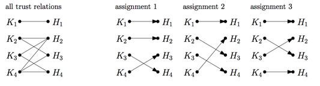

## 문제

Ardenia is going to war! The famous and prestigious Ardenia’s military unit consisting of 200 knights and 200 horses started to prepare for battles. During the preparation, k knights and k horses are chosen (the remaining ones simply stay at their barracks) and a special kind of mutual trust relation is established between certain knights and certain horses. In such case, we simply say that knight A trusts horse B (and vice versa). One horse can trust arbitrarily many knights and one knight can trust arbitrarily many horses.

For a given team of k knights and k horses, the trust relations between them determines the number of battles they are willing to fight. For each battle, each knight chooses a single horse he or she trusts: this creates an assignment. An example of 4 knights (K1, K2, K3 and K4) and 4 horses (H1, H2, H3 and H4) with trust relations is depicted below. There are 3 possible different assignments.

The assignments for two different battles have to be different (the knights would get bored otherwise) and all possible assignments have to be tried out (the knights are curious enough to test them all). They are pretty good at their fighting skills, which means that no knight or horse will be harmed during the making of the war.

Your mages predicted that the war would consist of n battles. Your task is to choose k knights and k horses and establish trust relations between them, so that they are prepared for exactly n battles.

The input contains several test cases. The first line of the input contains a positive integer Z ≤ 100, denoting the number of test cases. Then Z test cases follow, each conforming to the format described in section Input. For each test case, your program has to write an output conforming to the format described in section Output.

## 입력

The input instance is one line containing the number of battles, n ∈ [1, 106].

## 출력

The first line of the output should contain a single positive integer k ≤ 200. Each of the next k lines should consist of k binary digits (0 or 1, without spaces between them), where 1 in the j-th column of the i-th line means that knight i trusts horse j (and vice versa). The number of possible battles these knights and horses are prepared for should be exactly n.
