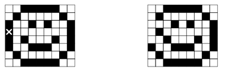

## 문제

The marketing and public-relations department of the Czech Technical University has designed a new reconfigurable mechanical Flip-Flop Bill-Board (FFBB). The billboard is a regular two-dimensional grid of R×C square tiles made of plastic. Each plastic tile is white on one side and black on the other. The idea of the billboard is that you can create various pictures by flipping individual tiles over. Such billboards will hang above all entrances to the university and will be used to display simple pictures and advertise upcoming academic events.

To change pictures, each billboard is equipped with a ”reconfiguration device”. The device is just an ordinary long wooden stick that is used to tap the tiles. If you tap a tile, it flips over to the other side, i.e., it changes from white to black or vice versa. Do you agree this idea is very clever?

Unfortunately, the billboard makers did not realize one thing. The tiles are very close to each other and their sides touch. Whenever a tile is tapped, it takes all neighboring tiles with it and all of them flip over together. Therefore, if you want to change the color of a tile, all neighboring tiles change their color too. Neighboring tiles are those that touch each other with the whole side. All inner tiles have 4 neighbors, which means 5 tiles are flipped over when tapped. Border tiles have less neighbors, of course.

For example, if you have the billboard configuration shown in the left picture above and tap the tile marked with the cross, you will get the picture on the right. As you can see, the billboard reconfiguration is not so easy under these conditions. Your task is to find the fastest way to ”clear” the billboard, i.e., to flip all tiles to their white side.

## 입력

The input consists of several billboard descriptions. Each description begins with a line containing two integer numbers R and C (1 ≤ R, C ≤ 16) specifying the billboard size. Then there are R lines, each containing C characters. The characters can be either an uppercase letter “X” (black) or a dot “.” (white). There is one empty line after each map. The input is terminated by two zeros in place of the board size.

## 출력

For each billboard, print one line containing the sentence “You have to tap T tiles.”, where T is the minimal possible number of taps needed to make all squares white. If the situation cannot be solved, output the string “Damaged billboard.” instead.
