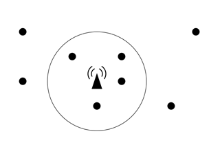

## 문제

Nowadays, everyone has a cellphone, or even two or three. You probably know where their name comes from. Do you? Cellphones can be moved (they are “mobile”) and they use wireless connection to static stations called BTS (Base Transceiver Station). Each BTS covers an area around it and that area is called a cell.

The Czech Technical University runs an experimental private GSM network with a BTS right on top of the building you are in just now. Since the placement of base stations is very important for the network coverage, your task is to create a program that will find the optimal position for a BTS. The program will be given coordinates of “points of interest”. The goal is to find a position that will cover the maximal number of these points. It is supposed that a BTS can cover all points that are no further than some given distance R. Therefore, the cell has a circular shape.

The picture above shows eight points of interest (little circles) and one of the possible optimal BTS positions (small triangle). For the given distance R, it is not possible to cover more than four points. Notice that the BTS does not need to be placed in an existing point of interest.

## 입력

The input consists of several scenarios. Each scenario begins with a line containing two integer numbers N and R. N is the number of points of interest, 1 ≤ N ≤ 2 000. R is the maximal distance the BTS is able to cover, 0 ≤ R < 10 000. Then there are N lines, each containing two integer numbers Xi, Yi giving coordinates of the i-th point, |Xi|, |Yi| < 10 000. All points are distinct, i.e., no two of them will have the same coordinates.

The scenario is followed by one empty line and then the next scenario begins. The last one is followed by a line containing two zeros.

A point lying at the circle boundary (exactly in the distance R) is considered covered. To avoid floating-point inaccuracies, the input points will be selected in such a way that for any possible subset of points S that can be covered by a circle with the radius R + 0.001, there will always exist a circle with the radius R that also covers them.

## 출력

For each scenario, print one line containing the sentence “It is possible to cover M points.”, where M is the maximal number of points of interest that may be covered by a single BTS.
