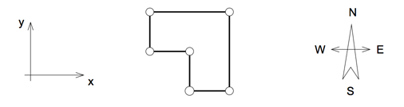

## 문제

직각 다각형의 모든 꼭짓점이 주어졌을 때, 모든 변을 구하는 프로그램을 작성하시오.

직각다각형의 모든 변은 X축 또는 Y축에 평행한다. 따라서, 모든 각의 크기는 90도 또는 270도이다.

## 입력

입력은 여러 개의 테스트 케이스로 이루어져 있다. 각 테스트 케이스의 첫째 줄에는 꼭짓점의 수 N (1 ≤ N ≤ 1000)이 주어진다. 다음 N개 줄에는 각 꼭짓점의 좌표 Xi와 Yi가 주어진다. (|Xi|, |Yi| ≤ 10,000)

두 꼭짓점이 같은 좌표를 가지는 경우는 없다. 또, 입력으로 주어지는 다각형은 항상 존재하며 닫혀있고, 두 변이 교차하거나 접하는 경우는 없다. (인접한 변 제외) 마지막으로, 다각형 내부에 구멍이 나 있는 경우도 없다. 즉, 다각형은 항상 닫힌 직선으로 이루어져 있다. 입력으로 주어지는 꼭짓점의 순서는 무작위이다.

각 테스트 케이스는 빈 줄로 구분되어 있으며, 입력의 마지막 줄에는 0이 하나 주어진다.

## 출력

각 테스트 케이스마다 N글자를 공백없이 출력한다. 출력하는 글자는 모두 대문자이며, 각각의 변을 나타낸다. "N"은 북쪽, "E"는 동쪽, "W"는 서쪽, "S"는 서쪽으로 나타내며, 첫 번째로 주어진 꼭짓점부터 시계방향으로 출력한다.

## 힌트

문제에서 주어진 그림은 두 번째 예제이다.
