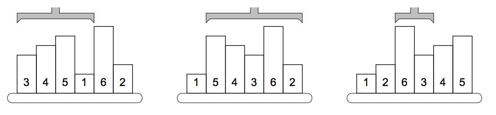

## 문제

Somewhere deep in the Czech Technical University buildings, there are laboratories for examining mechanical and electrical properties of various materials. In one of yesterday’s presentations, you have seen how was one of the laboratories changed into a new multimedia lab. But there are still others, serving to their original purposes.

In this task, you are to write software for a robot that handles samples in such a laboratory. Imagine there are material samples lined up on a running belt. The samples have different heights, which may cause troubles to the next processing unit. To eliminate such troubles, we need to sort the samples by their height into the ascending order.

Reordering is done by a mechanical robot arm, which is able to pick up any number of consecutive samples and turn them round, such that their mutual order is reversed. In other words, one robot operation can reverse the order of samples on positions between A and B.

A possible way to sort the samples is to find the position of the smallest one (P1) and reverse the order between positions 1 and P1, which causes the smallest sample to become first. Then we find the second one on position P2 and reverse the order between 2 and P2. Then the third sample is located etc.

The picture shows a simple example of 6 samples. The smallest one is on the 4th position, therefore, the robot arm reverses the first 4 samples. The second smallest sample is the last one, so the next robot operation will reverse the order of five samples on positions 2–6. The third step will be to reverse the samples 3–4, etc.

Your task is to find the correct sequence of reversal operations that will sort the samples using the above algorithm. If there are more samples with the same height, their mutual order must be preserved: the one that was given first in the initial order must be placed before the others in the final order too.

## 입력

The input consists of several scenarios. Each scenario is described by two lines. The first line contains one integer number N, the number of samples, 1 ≤ N ≤ 100 000. The second line lists exactly N space-separated positive integers, they specify the heights of individual samples and their initial order.

The last scenario is followed by a line containing zero.

## 출력

For each scenario, output one line with exactly N integers P1, P2,...PN , separated by a space. Each Pi must be an integer (1 ≤ Pi ≤ N) giving the position of the i-th sample just before the i-th reversal operation.

Note that if a sample is already on its correct position Pi, you should output the number Pi anyway, indicating that the “interval between Pi and Pi” (a single sample) should be reversed.
