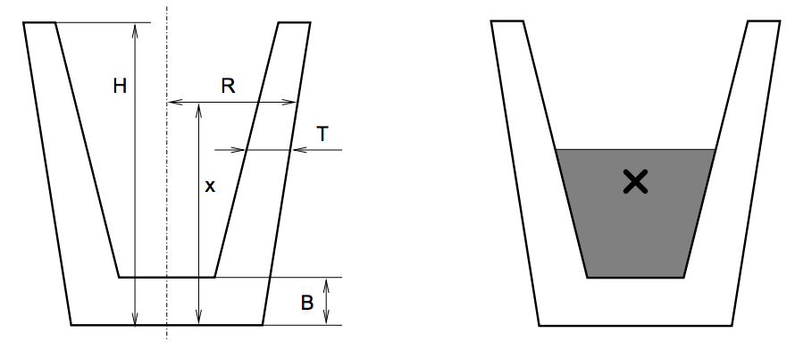

## 문제

Czech Technical University has the word “technical” in its name. Beside others, this means that lectures in physics are important here. Do you still remember some of the basic physical principles?

For example, imagine a simple glass of water. Or, we will rather call it a cup to avoid ambiguity of this word. So, imagine a simple cup (made of glass) that is partially filled with water. You might have noticed that the stability of such a cup depends on the amount of water inside. If you brush against a full cup, it is relatively easy to knock it down and spill its contents. If the cup is empty, there is fortunately nothing to be spilled, but other than that, the situation does not improve much — it is still easy to knock the cup down with only a little force. The best stability is usually achieved with a “half-full” cup.

In this problem, your task is to determine the water level that makes a cup as much stable as possible. For the purpose of this problem, we will make a simple assumption that the “stability” of a cup is higher, if its center of mass (sometimes also called the center of gravity) is lower (closer to the bottom).

The center of mass can be informally defined as follows: Imagine that glass and water consist of a very large number of very small particles. Then the center of mass is an average of the position of all these particles. The average is weighted by particle masses. Since the density of glass is approximately 2 500 kg.m−3 and the density of water only 1 000 kg.m−3, we will suppose that the mass of a glass particle is 2.5 times higher than the mass of a water particle of the same size.

All cups considered in this problem will have an exact rotary shape. But their radius may vary with the height — some cups are wider at the top, others are wider at the bottom. Also, the thickness of the glass may not be constant.

The left figure shows a typical cup considered in this problem. It can be fully described by its height (H), thickness of the bottom (B), and two functions R and T. Both of these functions take a current height as their argument and they give the outer radius (R) and glass thickness (T) in the appropriate height. Please note that the thickness is always measured strictly horizontally and may therefore not reflect the “real thickness” of the glass in its usual meaning.

## 입력

The input contains several cup descriptions. Each description consists of three lines. The first line contains two numbers: H (cup height) and B (bottom thickness), 0 <B<H ≤ 100. The second line contains an expression R(x) (radius), the third line an expression T(x) (glass thickness). All data are given in centimeters. The last description is followed by a line with two zeros.

The expressions will contain only digits (“0” through “9”), decimal points (“.”), four basic operators (“+”, “-”, “\*”, and “/”), parentheses (“(” and “)”), and the lowercase letters “x” denoting the input variable (height measured from the cup bottom).

* ∀x, 0 ≤ x ≤ H, the radius will satisfy: 0.1 < R(x) ≤ 100
* ∀x, B ≤ x ≤ H, the thickness will satisfy: 0.1 ≤ T(x) < R(x)

Arithmetical operators have their usual meaning and priorities, i.e., multiplication and division have a higher priority than addition and subtraction.

## 출력

For each cup, output the sentence “Pour L litres / W cm of water.”, where L is the amount of water that must be poured into the cup to reach the maximal stability (in litres). W is the water level (in centimeters) measured from the bottom of the cup. Both numbers must be given with exactly three decimal digits.
