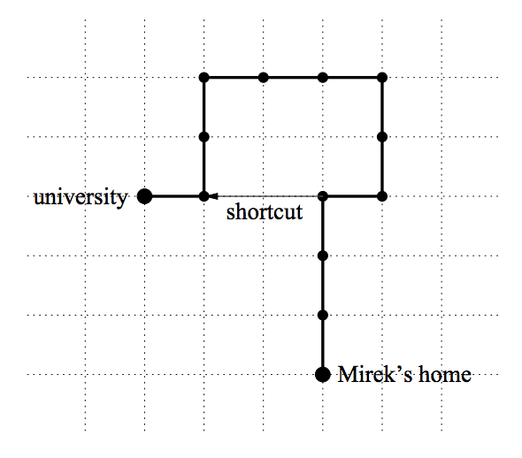

## 문제

Mirek has a favourite way from home to the university that he traverses every working day. The route consists of sections and each section is a straight segment 10 meters long. Each section is either a straight ahead extension of the previous section or it is perpendicular to the previous section. After traversing each section Mirek takes a small break to admire the beauty of the nature. During his walk he never visits the same place twice.

Yesterday Mirek stayed up long in the night at the party and today he got up late from bed. He knows that he will miss the first lecture unless he changes his usual route. He plans to make one shortcut but he wants the shortcut to be as short as possible (well, we can tell you in secret that he doesn't want to be on time, he just wants to calm his conscience). The shortcut must be either a horizontal or vertical segment connecting two break points of Mirek's route.

Please help Mirek find the shortest shortcut.

Write a program that:

* reads Mirek's route,
* computes the shortest shortcut on the route,
* writes the result.

## 입력

The first line of the input contains one integer n (3 ≤ n ≤ 250 000) being the number of sections of the route. The second line of the input contains a sequence of n characters `N`, `E`, `S` or `W` with no spaces in between. Each character is a description of one section of the route. Character `N`, `E`, `S` or `W` means that Mirek walks 10 meters north, east, south or west respectively. You may assume that at least one shortcut exists for the given route.

## 출력

The first and only line of the output contains integers l, b, e and character d separated by single spaces. Integer l is the length of the shortest shortcut (measured in 10 m segments). Integers b and e are the numbers of break points where the shortcut begins and ends respectively (we number break points with consecutive integers from 0 for Mirek's home to n for the university). Character d is the direction of the shortcut. If more than one shortcut of the minimal length exists you should output the one that begins earliest on the route. If more than one shortcut of the minimal length begins at the same break point you should output the one that ends furthest on the route.
