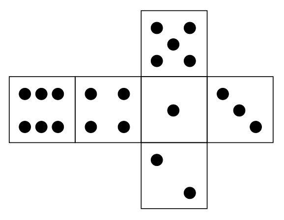

## 문제

Everyone loves gambling in the Dicent City. Every Saturday the whole community meets to attend a dice contest. They started a few years ago with a classic six-sided die with 1 to 6 dots displayed on the sides and had a lot of fun.

However they soon got bored and that's why more sophisticated dice are in use nowadays. They put a sticker on each side and write a positive integer on each sticker.

The contest is run on a strip divided into squares in a chessboard-like manner. The strip is 4 squares wide and infinite to the left and to the right (is anyone going to say it can't exist in the real world, huh?). The rows of the strip are numbered from 1 to 4 from the bottom to the top and the columns are numbered by consecutive integers from the left to the right. Each square is identified by a pair (x,y) where x is a column number and y is a row number.

The game begins with a die placed on a square chosen be a contest committee with one-dot side on the top and two-dots side facing the player. To move the die the player must roll the die over an edge to an adjacent (either horizontally or vertically) square. The number displayed on the top of the die after a roll is the cost of the move. The goal of the game is to roll the die from the starting square to the selected target square so that the sum of costs of all moves is minimal.

Write a program that:

* reads the description of a die, a starting square and a target square,
* computes the minimal cost of rolling the die from the starting square to the target square,
* writes the result.

## 입력

The first line of the input contains six integers l1, l2, l3, l4, l5, l6 (1 ≤ li ≤ 50) separated by single spaces. Integer li is the number written on a side having originally i dots. The second line of the input contains four integers x1, y1, x2, y2 (-109 ≤ x1, x2 ≤ 109, 1 ≤ y1, y2 ≤ 4) separated by single spaces. Integers x1, y1 are the column and the row number of the starting square respectively. Integers x2, y2 are the column and the row number of the target square respectively.

## 출력

The first and the only line of the output should contain the minimal cost of rolling the die from the starting square to the target square.
