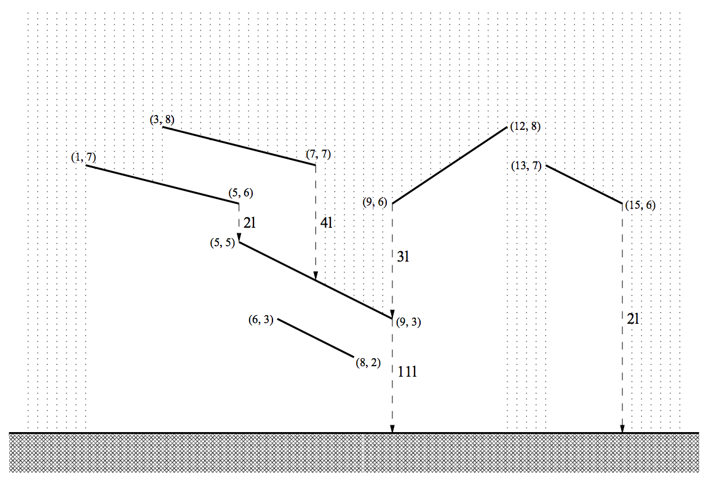

## 문제

Contemporary buildings can have very complicated roofs. If we take a vertical section of such a roof it results in a number of sloping segments. When it is raining the drops are falling down on the roof straight from the sky above. Some segments are completely exposed to the rain but there may be some segments partially or even completely shielded by other segments. All the water falling onto a segment as a stream straight down from the lower end of the segment on the ground or possibly onto some other segment. In particular, if a stream of water is falling on an end of a segment then we consider it to be collected by this segment.

For the purpose of designing a piping system it is desired to compute how much water is down from each segment of the roof. To be prepared for a heavy November rain you should count one liter of rain water falling on a meter of the horizontal plane during one second.

Write a program that:

* reads the description of a roof,
* computes the amount of water down in one second from each segment of the roof,
* writes the results.

## 입력

The first line of the input contains one integer n (1 ≤ n ≤ 40000) being the number of segments of the roof. Each of the next n lines describes one segment of the roof and contains four integers x1, y1, x2, y2 (0 ≤ x1, y1, x2, y2 ≤ 1000000, x1 < x2, y1 ≠ y2) separated by single spaces. Integers x1, y1 are respectively the horizontal position and the height of the left end of the segment. Integers x2, y2 are respectively the horizontal position and the height of the right end of the segment. The segments don't have common points and there are no horizontal segments. You can also assume that there are at most 25 segments placed above any point on the ground level.

## 출력

The output consists of n lines. The i-th line should contain the amount of water (in liters) down from the i-th segment of the roof in one second.
