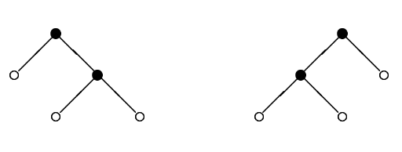

## 문제

Every computer science student knows binary trees. Here is one of many possible definitions of binary trees. Binary trees are defined inductively. A binary tree t is either an external node (leaf) ○ or an ordered pair t = (t1, t2) representing an internal node ● with two subtrees attached, left subtree t1 and right subtree t2. Under this definition the number of nodes in any binary tree is odd. Given an odd integer n let B(n) denote the set of all binary trees with n nodes, both internal and external. For instance B(1) consists of only one tree ○, B(3) = {(○,○)} and B(5) = {(○, (○,○)), ((○,○),○)}. The trees of B(5) are depicted in the figure below.

Denote by |t| the number of nodes in a tree t. Given a tree t we define its unique integer identifier N(t) as follows:

* N(○) = 0
* N(t1, t2) = 2|t1|+|t2| + 2|t2| · N(t1) + N(t2)

For instance, N (○,○) = 22 + 21 · 0 + 0 = 4, N (○,(○,○)) = 24 + 23 · 0 + 4 = 20, N ((○,○),○) = 24 + 21 · 4 + 0 = 24.

Consider the following linear order on all binary trees:

* ○ ⪯ t
* (t1, t2) ⪯ (u1, u2) when t1 ≺ u1, or t1 = u1 and t2 ⪯ u2

In this order a single leaf is the smallest tree and given two nonleaf trees, the smaller one is that with the smaller left tree, if the left subtrees are different, and that with the smaller right subtree, otherwise. Hence for instance (○,(○,○)) ≺ ((○,○),○), since we have ○ ≺ (○,○). Assume now that the trees in B(n) were sorted using the relation ⪯. Then, for each tree t in B(n) we define the successor of t as the tree that immediately follows t in B(n). If t is the largest one in B(n) then the successor of t is the smallest tree in set B(n). For instance, the successor of (○,○) in B(3) is the same tree (○,○) and the successor of (○,(○,○)) in B(5) is ((○,○),○).

Given the integer identifier of some tree t can you give the identifier of the successor of t in B(|t|)?

Write a program that:

* reads the identifier of some binary tree t,
* computes the identifier of the successor of t in B(|t|),
* writes the result.

## 입력

The first and only line of the input contains one integer n (0 ≤ n ≤ 230) - the identifier of some binary tree

## 출력

The first and only line of the output should contain one integer s - the identifier of the successor of t in B(|t|).
