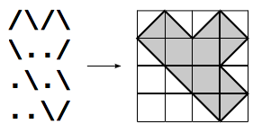

## 문제

창영이는 메모장에 '.', '\', '/'을 이용해서 도형을 그렸다. 각 문자는 그림에서 1\*1크기의 단위 정사각형을 나타낸다.

'.'은 빈 칸을 나타내며, '/'는 정사각형의 왼쪽 아래 꼭짓점과 오른쪽 위 꼭짓점이 연결된 선분을, '\'은 왼쪽 위 꼭짓점과 오른쪽 아래 꼭짓점이 연결된 선분을 나타낸다.

창영이가 그린 도형의 넓이를 출력하는 프로그램을 작성하시오.

## 입력

첫째 줄에 h와 w가 주어진다. h는 그림의 높이, w는 너비이다. (2 ≤ h,w ≤ 100)

다음 h개 줄에는 창영이가 메모장에 그린 다각형이 주어진다.

창영이가 그린 다각형은 1개이고, 변과 변이 서로 교차하는 경우는 없고, 자기 자신과 접하는 경우도 없다.

## 출력

첫째 줄에 다각형의 넓이를 출력한다.
