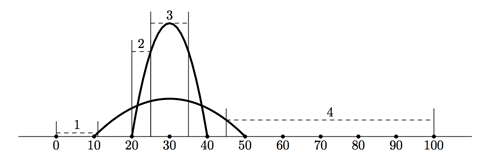

## 문제

Army is busy: military exercises had started yesterday. All types of forces are doing, hopefully, a good job. For example, artillery is launching missiles, while aviation is delivering supplies to infantry.

The military ground space is a straight line. Aviation bases and infantry regiments are located somewhere on the line, and artillery is launching ballistic missiles everywhere. All missile launches are planned (don’t forget, it’s just an exercise), each at a certain time along a certain trajectory. Aviation flights are also planned in certain time and space intervals. Everything will be fine, but there are those missiles, which can be deadly even during exercises!

You should help aviation generals to plan the minimal safe altitude for each flight. Given the information about flight’s time and space intervals, the minimal safe altitude for a flight is the minimal altitude such that all missile trajectories in the corresponding time and space interval are at or below this altitude. If there are no missiles in the flight’s time and space interval, then the minimal safe altitude is defined to be zero.

Ballistic missiles are launched from the ground, which is defined to have a zero altitude, and fly along a vertically symmetrical parabola. Missile speed is ignored for this problem, missiles are assumed to follow their trajectory instantaneously.

For example, the picture below shows trajectories of two ballistic missiles in solid lines, and the minimal safe altitudes for four different flights in dashed lines. Vertical lines delimit space intervals of each flight in this sample. Time intervals of the flights in this sample include the launch of both missiles.

## 입력

The first line of input contains a single integer n — the number of missile launches planned (1 ≤ n ≤ 50 000).

The following n lines describe one missile launch each. Each line contains three integers: the missile launch point p and coordinates of the highest point of missile trajectory x and y (0 ≤ p < x ≤ 50 000, 0 < y ≤ 50); p and x are coordinates along the military ground line, y gives the altitude of the highest point of missile trajectory. Missiles are launched one by one every minute in the order they are described in the input.

Next line contains the single integer m — the number of flights planned (1 ≤ m ≤ 20 000).

The following m lines describe one flight each. Each line contains four integers: t1 and t2 (1 ≤ t1 ≤ t2 ≤ n) — the time interval for the flight, and x1 and x2 (0 ≤ x1 ≤ x2 ≤ 50 000) — the space interval for the flight along the military ground line. Time and space intervals are inclusive of their endpoints. Time moment 1 corresponds to the first missile launch, and time moment n corresponds to the last one.

## 출력

For each flight write a separate line with the minimal safe altitude, with absolute error not exceeding 10−4.
