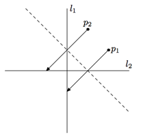

## 문제

The first formal axiom list for origami was published by Humiaki Huzita and Benedetto Scimemi and has come to be known as the Huzita axioms. These axioms describe the ways in which a fold line can be generated by the alignment of points and lines. A version of the six axioms follows.

1. For points p1 and p2, there is a unique fold that passes through both of them.
2. For points p1 and p2, there is a unique fold that places p1 onto p2.
3. For lines l1 and l2, there is a fold that places l1 onto l2.
4. For a point p1 and a line l1, there is a unique fold perpendicular to l1 that passes through point p1.
5. For points p1 and p2 and a line l1, there is a fold that places p1 onto l1 and passes through p2.
6. For points p1 and p2 and lines l1 and l2, there is a fold that places p1 onto l1 and p2 onto l2.

Roman is a good coder, but he is new to origami construction, so he decided to write a program to calculate the necessary folds for him. He already finished coding the cases for the first five axioms, but now he is stuck on the harder case, the axiom number 6. So he decided to hire a team of good coders — your team — to implement this case for his program.

## 입력

The input consists of one or more test cases. The total number of test cases t is specified in the first line of the input file. It does not exceed 20 000.

Each test case consists of exactly four lines, describing l1, p1, l2 and p2, in that order. Each line is described by four integers — the coordinates of two different points lying on it: x1, y1, x2, y2. Each point is described just by two integers — its x and y coordinates. All coordinates do not exceed 10 by their absolute values. It is guaranteed that neither p1 lies on l1 nor p2 lies on l2. Lines l1 and l2 are different, but points p1 and p2 may be the same.

## 출력

For each test case write a separate line with the description of the straight line one should use for folding. Use the same format as in the input — specify the coordinates of two points on it. Either x or y coordinates of those two points must differ by at least 10−4. Coordinates must not exceed 109 by their absolute value. The judging program will check that both the distance between p1 after folding and l1; and the distance between p2 after folding and l2 do not exceed 10−4. If there are multiple solutions, any one will do. If there are no solutions, output the line of four zeros, separated by spaces.

## 힌트

The picture to the right illustrates the first sample. The fold line is dashed.
