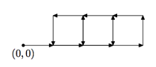

## 문제

There is a robot who lives on a cartesian plane and likes to walk around it. One day he planned a very interesting journey around the plane. To make that journey he developed a program which he is going to follow. The program consists of n functions: f1, f2, . . ., fn. The i-th function fi is a sequence of ci commands. Each command is of one of the following types:

* GO: Move forward one meter;
* LEFT: Turn 90 degrees to the left;
* RIGHT: Turn 90 degrees to the right;
* Fk: Follow the instructions of the function fk, then continue following the instructions of the current function.

The robot starts the journey at his home located at the point with coordinates (0, 0) following the instructions of the function f1.

For example, consider the following set of functions:

* f1: GO F2 GO F2 GO F2
* f2: F3 F3 F3 F3
* f3: GO LEFT

The robot’s journey for that case is shown on the picture.

In some cases the journey of the robot might never end. Consider for example the set of instructions consisting of one function f1 that has the following commands: GO F1. In that case the robot keeps going forward and never stops.

The question that puzzles the robot now is how far from the home will he get during his journey. That is, consider the set of all points which the robot will visit. Find the maximum value of |x|+|y| among all those points. If there are points on the path of the robot with arbitrarily large values of |x| + |y|, output “Infinity”.

## 입력

The first line of the input file consists of an integer number n (1 ≤ n ≤ 100). The following n lines contain a description of the functions. The i-th line describes function fi. It consists of the number ci (1 ≤ ci ≤ 100) — the number of commands for function fi, followed by a description of each command.

## 출력

Output the maximum value of |x| + |y| among all points visited during the journey or “Infinity”.
