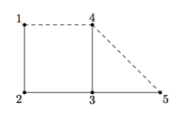

## 문제

The Kingdom consists of n cities connected by n − 1 roads in such a way that there is exactly one way to travel from one city to another.

The King is a busy man and he constantly travels from city to city. Unfortunately, during one of his travels one of the roads got damaged and needed serious repairs. As a result, the King was unable to reach his destination in time.

After the incident the King decided to improve reliability of the road system. It was decided that the improved road system shall be able to withstand one damaged road, i.e. there shall always be a path from one city to another even when one road in the Kingdom is damaged. As always, the budget is limited so you need to minimize the number of new roads.

For example, the picture below shows 5 Kingdom’s cities numbered from 1 to 5 and roads between them in solid lines. One of the ways to build new roads is shown in dashed lines.

Your task is to build as few new roads as possible so that there is always a path between any two cities even if one of the roads gets unusable for any reason. There may be multiple optimal solutions. Any one can be used.

## 입력

The first line of the input file contains integer n — the number of cities in the kingdom (2 ≤ n ≤ 100 000). The following n − 1 lines contain two integers ui, vi each — the cities connected by i-th road (1 ≤ ui, vi ≤ n).

## 출력

The first line of the output file shall contain one integer k — the number of roads to be built. The following k lines shall contain two integers ai, bi each — the cities which should be connected by i-th new road (1 ≤ ai, bi ≤ n).
