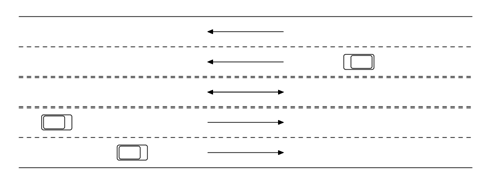

## 문제

Intercity Council for People Commute (ICPC) is in charge of operating a new bridge that connects two busy communities across the river. The bridge does not have enough throughput to accept the maximal traffic that can arrive on both sides of the bridge. The bridge has just a total of n lanes in both directions, while roads that connect to the bridge on both sides are wider.

However, the traffic on both sides of the bridge is not symmetric. In the morning more people travel from the left side of the bridge to the right side, while in the evening more people travel from the right side to the left side. So it was decided to configure a bridge with n1 lanes for left-to-right traffic, n2 lanes for right-to-left traffic, and leave one lane in the center as a reversible one (n1 + 1 + n2 = n). In the morning the central lane will be open for left-to-right traffic, while in the evening the central lane will be open for right-to-left traffic.

The challenge is to figure out the optimal time to switch the direction of the central reversible lane.

In order to address this challenge, ICPC had gathered the data on the traffic on the typical day. The whole day from the morning to the evening was split into equal time intervals. The duration of time intervals was conveniently chosen in such a way, that the throughput of one lane is exactly one car per time interval. Time intervals were numbered from 1 in the morning to m in the evening and the data on the number of cars arriving at each of m time intervals at each side of the bridge was gathered.

The traffic is modeled at each time interval in both direction starting from the first time interval in the following way:

New cars arrive at the bridge.  
Cars start crossing the bridge in the corresponding direction according to the number of lanes currently open in the given direction.  
Remaining cars wait in the queue for the next time interval.

If there are still cars waiting at any side of the bridge after time interval m, then additional time intervals are modeled in the same way until all cars start crossing the bridge and no cars are waiting to cross, assuming that no more new cars arrive at the bridge after time interval m.

The reversal of the central lane in not instantaneous process. It takes time to let cars safely clear out the central lane before the lane can be open for the traffic in the reverse direction. The central lane will have to be closed for r time intervals. It means, that if decision to reverse the lane on time interval t (1 ≤ t ≤ m) is made, then the bridge will have n1 + 1 lanes open from left-to-right traffic and n2 lanes for right-to-left traffic before time interval t; n1 and n2 lanes correspondingly from time interval t to time interval t+r −1 inclusive; and n1 and n2 + 1 lanes correspondingly on time interval t+r and afterwards.

The problem is to find such time interval t (1 ≤ t ≤ m) to reverse the central lane, that minimizes the total time that all cars in both directions have to wait in the queue. If the are multiple optimal time intervals, then the earliest one has to be found.

## 입력

The first line of the input file contains four integer numbers n1, n2, m, and r; n1 and n2 (1 ≤ n1, n2 ≤ 10) represent the number of permanently open lanes for left-to-right and right-to-left traffic respectively; m (1 ≤ m ≤ 100 000) is the number of time intervals in a day; r (1 ≤ r ≤ m) is the number of time intervals that the central lane is closed for new traffic on reversal.

The following m lines contains traffic data on the typical day. Each line describes time interval from 1 to m with two integer numbers — the number of cars arriving at the bridge on the left and on the right. There are at most 100 arriving cars at each time interval on each side.

## 출력

Write to the output file a single integer t — the earliest optimal time interval to reverse the central lane per the problem statement.

## 힌트

The tables below model the traffic for the above sample, showing at each time interval the number of lanes open in the given direction, the number of cars that arrive at each time interval (step 1 in the traffic model as given in the problem statement), the number of cars that start crossing the bridge (step 2), and the number of cars remaining in the queue (step 3). The total wait time in the queue is 20 time intervals (10 for left-to-right cars and 10 for right-to-left). Time interval 11 is explicitly shown in this table to clarify that there is no traffic on this time interval and after it in this particular sample.

| time | 1 | 2 | 3 | 4 | 5 | 6 | 7 | 8 | 9 | 10 | 11 |
| --- | --- | --- | --- | --- | --- | --- | --- | --- | --- | --- | --- |
| left-to-right lanes | 3 | 3 | 3 | 2 | 2 | 2 | 2 | 2 | 2 | 2 | 2 |
| left-to-right cars | 1 | 2 | 3 | 4 | 3 | 2 | 1 | 0 | 1 | 0 | 0 |
| left-to-right cross | 1 | 2 | 3 | 2 | 2 | 2 | 2 | 2 | 1 | 0 | 0 |
| left-to-right queue | 0 | 0 | 0 | 2 | 3 | 3 | 2 | 0 | 0 | 0 | 0 |
| right-to-left lanes | 2 | 2 | 2 | 2 | 2 | 3 | 3 | 3 | 3 | 3 | 3 |
| right-to-left cars | 0 | 1 | 2 | 2 | 3 | 3 | 5 | 3 | 2 | 1 | 0 |
| right-to-left cross | 0 | 1 | 2 | 2 | 2 | 3 | 3 | 3 | 3 | 3 | 0 |
| right-to-left queue | 0 | 0 | 0 | 0 | 1 | 1 | 3 | 3 | 2 | 0 | 0 |
