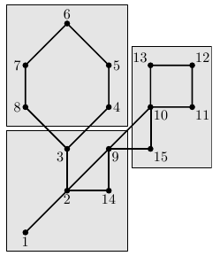

## 문제

Advanced Cave Megapolis (ACM) is a city that survives in the underground caves after the global nuclear war. The caves are connected by passages and the whole city map can be represented by a graph with caves being vertices and passages between them being nodes.

There is a revolution in the cave city. The whole population of the city is evenly split into k parties that cannot agree on the common laws that they should adopt. They had decided to split their city into k districts and have each district’s citizens impose the laws of their liking upon themselves.

You are given a city map in the form of the graph and your task is to write a program that partitions this graph into k equally sized districts. Each district must form a connected subgraph that is represented by the subset of the graph’s vertices.

Fortunately, the number of vertices in the graph is divisible by k and the graph representing the city happens to be a cactus — a connected undirected graph in which every edge belongs to at most one simple cycle. Intuitively, cactus is a generalization of a tree where some cycles are allowed.

The example of a city map with 15 caves and its partitioning into 3 districts is shown on the picture below.

## 입력

The first line of the input file contains three integer numbers n, m, and k (1 ≤ n ≤ 50 000, 0 ≤ m ≤ 10 000, 1 ≤ k ≤ n). Here n is the number of vertices in the graph. Vertices are numbered from 1 to n. Edges of the graph are represented by a set of edge-distinct paths, where m is the number of such paths, k is the number of districts that the city must be partitioned into, n is divisible by k.

Each of the following m lines contains a path in the graph. A path starts with an integer number si (2 ≤ si ≤ 1000) followed by si integers from 1 to n. These si integers represent vertices of a path. Adjacent vertices in a path are distinct. Path can go through the same vertex multiple times, but every edge is traversed exactly once in the whole input file. There are no multiedges in the graph (there is at most one edge between any two vertices).

The graph in the input file is a cactus.

## 출력

If it is possible to partition the vertices into k districts, write to the output file k lines with n/k integer numbers on each line. Each line represents a district as a list of vertices’ numbers that constitute it. Vertex numbers must be listed in the ascending order in the description of each district.

If the answer does not exist, write the single number −1.
