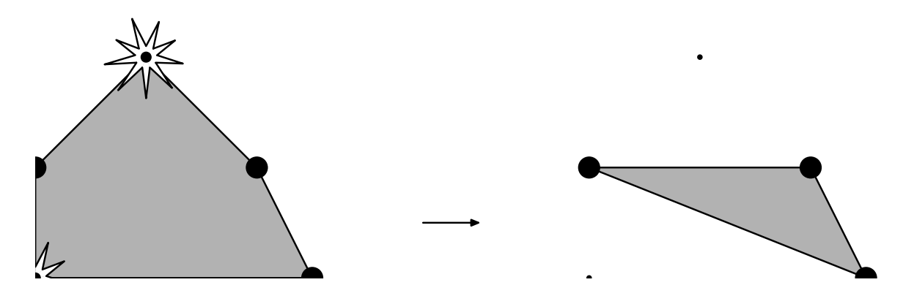

## 문제

There is a military base lost deep in the jungle. It is surrounded by n watchtowers with ultrasonic generators. In this problem watchtowers are represented by points on a plane.

Watchtowers generate ultrasonic field and protect all objects that are strictly inside the towers’ convex hull. There is no tower strictly inside the convex hull and no three towers are on a straight line.

The enemy can blow up some towers. If this happens, the protected area is reduced to a convex hull of the remaining towers.

The base commander wants to build headquarters inside the protected area. In order to increase its security, he wants to maximize the number of towers that the enemy needs to blow up to make the headquarters unprotected.

## 입력

The first line of the input file contains a single integer n (3 ≤ n ≤ 50 000) — the number of watchtowers. The next n lines of the input file contain the Cartesian coordinates of watchtowers, one pair of coordinates per line. Coordinates are integer and do not exceed 106 by absolute value. Towers are listed in the order of traversal of their convex hull in clockwise direction.

## 출력

Write to the output file the number of watchtowers the enemy has to blow up to compromise headquarters protection if the headquarters are placed optimally.
