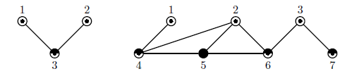

## 문제

You are given a connected undirected graph with an odd number of vertices. The degree of the vertex, by definition, is the number of edges incident to it. In the given graph the degree of each vertex does not exceed an odd number k. Your task is to color the vertices of this graph into at most k distinct colors, so that the colors of any two adjacent vertices are distinct.

The pictures below show two graphs. The first one has 3 vertices and the second one has 7 vertices. In both graphs degrees of the vertices do not exceed 3 and the vertices are colored into at most 3 different colors marked as ‘’, ‘

## 입력

The first line of the input file contains two integer numbers n and m, where n is the number of vertices in the graph (3 ≤ n ≤ 9999, n is odd), m is the number of edges in the graph (2 ≤ m ≤ 100 000). The following m lines describe edges of the graph, each edge is described by two integers ai, bi (1 ≤ ai, bi ≤ n, ai ≠ bi) — the vertex numbers connected by this edge. Each edge is listed at most once. The graph in the input file is connected, so there is a path between any pair of vertices.

## 출력

On the first line of the output file write a single integer number k — the minimal odd integer number, such that the degree of any vertex does not exceed k. Then write n lines with one integer number ci (1 ≤ ci ≤ k) on a line that denotes the color of i-th vertex.

The colors of any two adjacent vertices must be different. If the graph has multiple different colorings, print any of them. At least one such coloring always exists.
