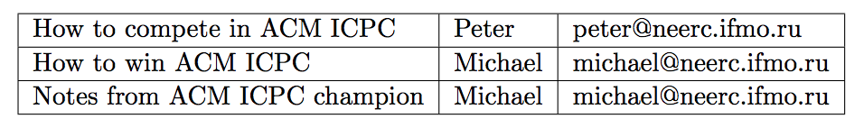
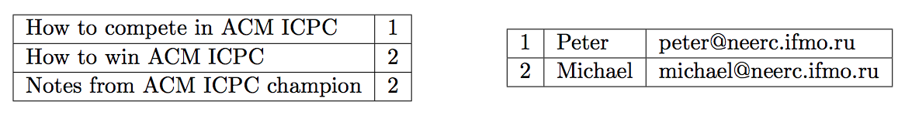

## 문제

Peter studies the theory of relational databases. Table in the relational database consists of values that are arranged in rows and columns.

There are different normal forms that database may adhere to. Normal forms are designed to minimize the redundancy of data in the database. For example, a database table for a library might have a row for each book and columns for book name, book author, and author’s email.

If the same author wrote several books, then this representation is clearly redundant. To formally define this kind of redundancy Peter has introduced his own normal form. A table is in Peter’s Normal Form (PNF) if and only if there is no pair of rows and a pair of columns such that the values in the corresponding columns are the same for both rows.

The above table is clearly not in PNF, since values for 2rd and 3rd columns repeat in 2nd and 3rd rows. However, if we introduce unique author identifier and split this table into two tables — one containing book name and author id, and the other containing book id, author name, and author email, then both resulting tables will be in PNF.

Given a table your task is to figure out whether it is in PNF or not.

## 입력

The first line of the input file contains two integer numbers n and m (1 ≤ n ≤ 10 000, 1 ≤ m ≤ 10), the number of rows and columns in the table. The following n lines contain table rows. Each row has m column values separated by commas. Column values consist of ASCII characters from space (ASCII code 32) to tilde (ASCII code 126) with the exception of comma (ASCII code 44). Values are not empty and have no leading and trailing spaces. Each row has at most 80 characters (including separating commas).

## 출력

If the table is in PNF write to the output file a single word “YES” (without quotes). If the table is not in PNF, then write three lines. On the first line write a single word “NO” (without quotes). On the second line write two integer row numbers r1 and r2 (1 ≤ r1, r2 ≤ n, r1 ≠ r2), on the third line write two integer column numbers c1 and c2 (1 ≤ c1, c2 ≤ m, c1 ≠ c2), so that values in columns c1 and c2 are the same in rows r1 and r2.
