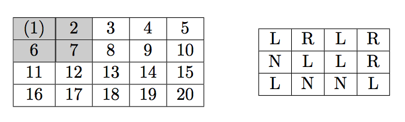
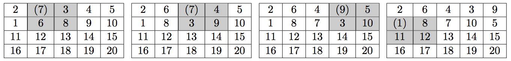

## 문제

Pavel had invented a new game with a matrix of integer numbers. He takes r × c matrix with r rows and c columns that is filled with numbers from 1 to rc left to right and top to bottom (1 is written in the upper-left corner, rc is written in the lower-right corner). Then he starts to rearrange the numbers is the matrix by following the rules that are explained below and writes down a sequence of numbers on a separate piece of paper. He calls it garbling of the matrix.

The rules of rearrangement are defined by garbling map that is (r − 1) × (c − 1) matrix of letters L, R, and N. Initial 4 × 5 matrix and the sample 3 × 4 garbling map for it are shown below.

Pavel garbles the matrix in a series of turns. On his first turn Pavel takes the number in the first row and the first column (it is put in parenthesis on the above picture for clarity) and writes it down.

Having written down the number he performs one garbling turn:

Pavel looks at the letter in the garbling map that corresponds to the position of the number he had just written down (one the first turn it is the letter in the upper-left corner). Depending on the letter in the garbling map the 2 × 2 block of the matrix whose upper-left corner contains the number he had just written (highlighted in the above picture) is rearranged in the following way:

* R — the block is rotated clockwise.
* L — the block is rotated counterclockwise.
* N — Pavel does not change the matrix on this turn.

On the second turn Pavel takes the number in the first row and second column, writes it down, and performs the garbling turn, and so on. In c − 1 turns he finishes the first row and moves to the second row and so on he proceeds left to right and top to bottom. In (r − 1)(c − 1) turns he had written down (r−1)(c−1) numbers and garbled the whole matrix, so he starts again in the upper-left corner continuing garbling the matrix from left to right and top to bottom.

The matrices below show the effect of the first four turns with the sample garbling map.

The following sequence of numbers is written down in the first 4 turns: 1 7 7 9. On 5th turn the number from the second row and the first column is written, but the matrix remains unchanged, since the second row and the first column of the garbling map contains N. In six turns Pavel gets 1 7 7 9 1 8.

Given the garbling map and the number of moves Pavel makes in this game, find out how many times each number gets written down by Pavel. You need to provide the answer modulo 105.

## 입력

The first line of the input file contains three integer numbers — r, c, and n, where r, c (2 ≤ r, c ≤ 300) are the dimensions of the initial matrix, n (0 ≤ n < 10100) is the number of turns Pavel makes.

The following r − 1 lines contain garbling map with c − 1 characters R, L, or N on a line.

## 출력

Write to the output file rc lines with one integer number per line. On i-th line write the number of times number i gets written down by Pavel modulo 105 while he makes his n turns.
