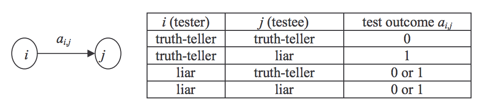
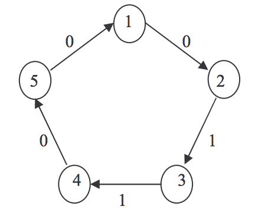

## 문제

There are n ≥ 2 people labeled as 1, 2, … , n such that each of them is either a truth-teller or a liar, and the number of liars is less than or equal to t for some t (≤ n).

Each person i can test another person j in order to identify person j as truth-teller or liar by giving some question to person j. The outcome ai,j of the test applied by person i to person j is 1 (0) if person i identifies person j as a liar (truth-teller). The test outcome ai,j is reliable if and only if the testing person i is a truth-teller. That is, the test outcome ai,j is unreliable if and only if the testing person i is a liar. The following table shows the value of the test outcome ai,j when person i tests person j.

Testing is performed circularly as follows: person 1 tests person 2, person 2 tests person 3, …, person n-1 tests person n, and person n tests person 1. From the test outcomes, some persons are definitely liars, but some others may or may not be liars. From n, t, and the test outcomes, determine the persons who are definitely liars.

For example, let n = 5, t = 2, and the test outcomes (a1,2, a2,3, a3,4, a4,5, a5,1) be (0, 1, 1, 0, 0). In the following figure, each circle represents a person, and the label on the edge (i, j) represents the test outcome ai,j.

In this example, person 3 should be a liar because if not, person 4 is liar and persons 2 is liar, thus persons 1, 5, and 4 become liars, which contradicts the condition that the number of liars does not exceed t = 2. Therefore person 3 is determined as a definite liar. However, because both {person 3, person 4} and {person 3} can be sets of liars, we can't determine that person 4 is a liar.

Given n (the number of persons), t (the maximum number of liars), and the set of test outcomes, write a program to find all the persons who are definitely liars. It is assumed that the given set of outcomes is one that results from some liars who are less than or equal to t.

## 입력

The input consists of T test cases. The number of test cases (T ) is given in the first line of the input file. Each test case consists of two lines. The first line has two integers. The first integer is n (1≤n ≤1000), the number of persons, and the second integer is t (0 ≤ t ≤ n ), the maximum number of liars. The second line contains n 0 or 1’s that represent a1,2, a2,3, a3,4, …, a(n-1),n, an,1.

## 출력

Print exactly one line for each test case. The line should contain two integers. The first integer is the number of all the definite liars. The second integer is the smallest label of definite liars. In case that the number of definite liars is equal to 0, then the second integer should be 0.
