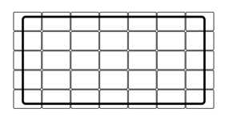

## 문제

상근이는 모니터를 여러개 붙여서 대형 모니터를 만드는 일을 하고 있다.

고객은 대형 모니터의 가로, 세로 해상도(픽셀)과 가로 세로 크기(밀리미터)를 상근이에게 주문한다. 상근이는 고객의 주문 값보다 크거나 같은 해상도, 크거나 같은 크기의 대형 모니터를 만들어야 한다. 이때, 제조비가 최소가 되어야 한다.

대형 모니터는 항상 같은 종류의 모니터로 만들어야 한다. 대형 모니터의 해상도, 크기는 모니터를 붙인 형태로 각각을 더하면 되고, 가격은 사용한 모니터의 가격의 합이다.

상근이의 창고에는 모니터가 여러 종류가 있고, 각각의 해상도와 크기, 가격은 모두 알고 있다. 모니터를 회전 시켜서 대형 모니터를 만들 수 있다. 하지만, 대형 모니터에 포함된 모니터는 모두 같은 방향이어야 한다. 상근이는 모니터를 매우 많이 가지고 있어, 필요한 만큼 사용할 수 있다.

## 입력

첫째 줄에 대형 모니터의 가로 세로 해상도, 가로 세로 크기 rh, rv, sh, sv가 주어진다. 각 값은 100보다 크거나 같고, 10,000보다 작거나 같은 정수이다.

다음 줄에는 상근이가 가지고 있는 모니터 종류의 개수 n이 주어진다. (1 ≤ n ≤ 100)

다음 n개 줄에는 각 모니터의 가로 세로 해상도, 가로 세로 크기, 가격 rh,i, rv,i, sh,i, sv,i, pi 가 주어진다. 이 값도 모두 100보다 크거나 같고, 10,000보다 작거나 같다.

## 출력

첫째 줄에 대형 모니터를 만드는 가격 중 가장 저렴한 가격을 출력한다.
