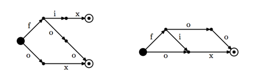

## 문제

결정적 유한 오토마타(DFA)는 방향성이 있는 멀티그래프로 정점은 상태, 간선은 전이라고 부른다.

모든 DFA의 전이에는 글자 하나가 붙여져 있다. 또, 각각의 상태 s와 각각의 글자 l에 대해서, l이 붙여져 있으면서 s를 떠나는 전이의 개수는 최대 한 개이다.

DFA에는 시작 상태가 하나 있고, 최종 상태가 있다. 최종 상태는 상태의 부분 집합이다. DFA는 어떤 언어의 모든 단어를 정의할 수 있다. 이때, 모든 단어는 시작 상태에서 어떤 최종 상태로 가는 경로 상에 쓰여 있는 글자이어야 한다.

단어의 개수가 유한개인 언어가 주어진다면, 항상 이 언어의 DFA를 만들 수 있다. 왼쪽 그림은 fix, foo, ox로 이루어진 언어를 DFA로 나타낸 것이다. 하지만, 이 DFA의 상태는 총 7개가 있고 상태의 개수가 가장 적은 경우가 아니다. 오른쪽 그림은 상태의 수가 5개이고 이 언어를 5개보다 적은 상태로 나타낼 수 없다.

어떤 언어가 주어졌을 때, 이 언어의 DFA를 만드늗네 필요한 상태의 최소 개수를 구하는 프로그램을 작성하시오.

## 입력

첫째 줄에 단어의 개수 n이 주어진다. (1 ≤ n ≤ 5000) 다음 n개 줄에는 단어가 한 줄에 하나씩 주어진다. 단어는 알파벳 소문자로만 이루어져 있고 길이는 최대 30이다. 입력으로 주어지는 모든 단어는 서로 다르다.

## 출력

첫째 줄에 입력으로 주어진 언어의 DFA를 만드는데 필요한 상태의 최소 개수를 출력한다.
