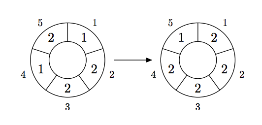

## 문제

A cellular automaton is a collection of cells on a grid of specified shape that evolves through a number of discrete time steps according to a set of rules that describe the new state of a cell based on the states of neighboring cells. The order of the cellular automaton is the number of cells it contains. Cells of the automaton of order n are numbered from 1 to n.

The order of the cell is the number of different values it may contain. Usually, values of a cell of order m are considered to be integer numbers from 0 to m − 1.

One of the most fundamental properties of a cellular automaton is the type of grid on which it is computed. In this problem we examine the special kind of cellular automaton — circular cellular automaton of order n with cells of order m. We will denote such kind of cellular automaton as n,m-automaton.

A distance between cells i and j in n,m-automaton is defined as min(|i−j|, n−|i−j|). A d-environment of a cell is the set of cells at a distance not greater than d.

On each d-step values of all cells are simultaneously replaced by new values. The new value of cell i after d-step is computed as a sum of values of cells belonging to the d-enviroment of the cell i modulo m.

The following picture shows 1-step of the 5,3-automaton.

The problem is to calculate the state of the n,m-automaton after k d-steps.

## 입력

The first line of the input file contains four integer numbers n, m, d, and k (1 ≤ n ≤ 500, 1 ≤ m ≤ 1 000 000, 0 ≤ d < n/2 , 1 ≤ k ≤ 10 000 000). The second line contains n integer numbers from 0 to m − 1 — initial values of the automaton’s cells.

## 출력

Output the values of the n,m-automaton’s cells after k d-steps.
