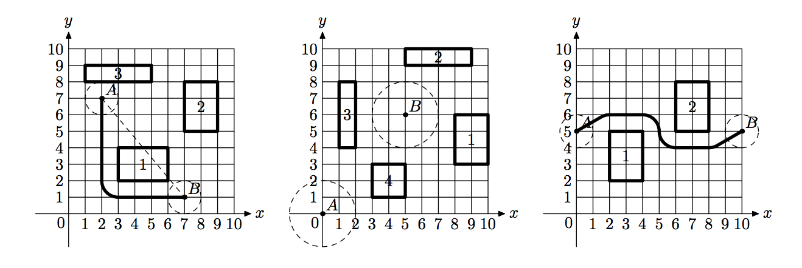

## 문제

Contrary to the popular belief, alien flying saucers cannot fly arbitrarily around our planet Earth. Their touch down and take off maneuvers are extremely energy consuming, so they carefully plan their mission to Earth to touch down in one particular place, then hover above the ground carrying out their mission, then take off. It was all so easy when human civilization was in its infancy, since flying saucers can hover above all the trees and building, and their shortest path from one mission point to the other was usually a simple straight line — the most efficient way to travel. However, modern cities have so tall skyscrapers that flying saucers cannot hover above them and the task of navigating modern city became quite a complex one. You were hired by an alien spy to write a piece of software that will ultimately give flying saucers driving directions throughout the city. As your first assignment (to prove your worth to your alien masters) you should write a program that computes the shortest distance for a flying saucer from one point to another. This program will be used by aliens as an aid in planning of mission energy requirements.

The problem is simplified by several facts. First of all, since flying saucer can hover above most of the buildings, you are only concerned with locations of skyscrapers. Second, the problem is actually twodimensional — you can look at everything “from above” and pretend that all objects are situated on OXY Cartesian plane. Flying saucer is represented by a circle of radius r, and since modern cities with skyscrapers tend to be regular, every skyscraper is represented with a rectangle whose sides are parallel to OX and OY axes.

By definition, the location of flying saucer is the location of its center, and the length of the path it travels is the length of the path its center travels. During its mission flying saucer can touch skyscrapers but it cannot intersect them.

At the first picture a flying saucer of r = 1 has to get from point A to point B. The straight dashed line would have been the shortest path if not for skyscraper 1. The shortest way to avoid skyscraper 1 is going around its top right corner, but skyscraper 2 is too close to fly there. Thus, the answer is to go around the bottom left corner of skyscraper 1 for a total path length of 10.570796.

In the second picture it is impossible for a flying saucer of r = 2 to get from point A to point B, since all skyscrapers are too close to fly in between them.

In the third picture flying saucer of r = 1 has to fly in a slalom-like way around two skyscrapers in order to achieve the shortest path of length 11.652892 between A and B.

## 입력

The first line of the input file contains integer numbers r and n (1 ≤ r ≤ 100, 0 ≤ n ≤ 30), where r is the radius of the flying saucer, and n is the number of skyscrapers. The next line contains four integer numbers xA, yA, xB, and yB (−1000 ≤ xA, yA, xB, yB ≤ 1000), where (xA, yA) are the coordinates of the starting point of the flying saucer’s mission and (xB, yB) are the coordinates of its finishing point.

The following n lines describe skyscrapers. Each skyscraper is represented by four integer numbers x1, y1, x2, and y2 (−1000 ≤ x1, y1, x2, y2 ≤ 1000, x1 < x2, y1 < y2) — coordinates of the corners of the corresponding rectangle.

Skyscrapers neither intersect nor touch each other. Starting and finishing points of the flying saucer’s mission are valid locations for flying saucer, that is, it does not intersect any skyscraper in those points, but may touch some of them.

## 출력

Write to the output file text “no solution” (without quotes) if the flying saucer cannot reach its finishing point from the starting one. Otherwise, write to the output file a single number — the shortest distance that the flying saucer needs to travel to get from the starting point to the finishing point. Answer has to be precise to at least 6 digits after the decimal point.
