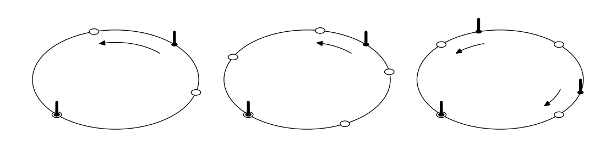

## 문제

Programming contests became so popular in the year 2397 that the governor of New Earck — the largest human-inhabited planet of the galaxy — opened a special Alley of Contestant Memories (ACM) at the local graveyard. The ACM encircles a green park, and holds the holographic statues of famous contestants placed equidistantly along the park perimeter. The alley has to be renewed from time to time when a new group of memorials arrives.

When new memorials are added, the exact place for each can be selected arbitrarily along the ACM, but the equidistant disposition must be maintained by moving some of the old statues along the alley.

Surprisingly, humans are still quite superstitious in 24th century: the graveyard keepers believe the holograms are holding dead people souls, and thus always try to renew the ACM with minimal possible movements of existing statues (besides, the holographic equipment is very heavy). Statues are moved along the park perimeter. Your work is to find a renewal plan which minimizes the sum of travel distances of all statues. Installation of a new hologram adds no distance penalty, so choose the places for newcomers wisely!

## 입력

Input file contains two integer numbers: n — the number of holographic statues initially located at the ACM, and m – the number of statues to be added (2 ≤ n ≤ 1000, 1 ≤ m ≤ 1000). The length of the alley along the park perimeter is exactly 10 000 feet.

## 출력

Write a single real number to the output file — the minimal sum of travel distances of all statues (in feet). The answer must be precise to at least 4 digits after decimal point.

## 힌트

Pictures show the first three examples. Marked circles denote original statues, empty circles denote new equidistant places, arrows denote movement plans for existing statues.
