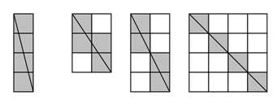

## 문제

R은 변의 길이가 정수인 직사각형이다. 직사각형은 단위 정사각형으로 나눌 수 있다.

f(R)은 직사각형의 한 대각선이 지나는 정사각형의 개수라고 정의한다. 변의 길이가 2와 4인 직사각형 R의 f(R) = 4이다.

N이 주어졌을 때, f(R) = N을 만족하는 직사각형의 개수를 구하는 프로그램을 작성하시오. 변의 길이가 a×b인 직사각형과 b×a인 직사각형은 같은 직사각형이다.

## 입력

첫째 줄에 자연수 N (0 < N < 106)이 주어진다.

## 출력

첫째 줄에 f(R) = N인 R의 개수를 출력한다.

## 힌트

