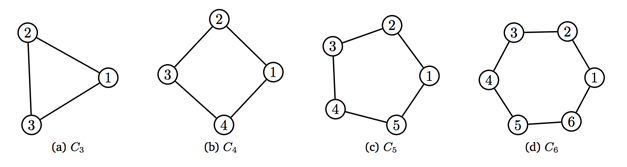
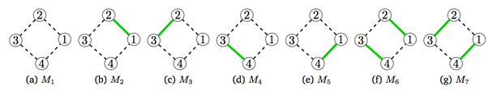

## 문제

그래프 이론에서 매칭(또는 독립 간선 집합)은 공통 정점을 가지지 않는 간선의 집합을 말한다.

그래프 G = (V,E)가 주어졌을 때, M이 G의 매칭이 되기 위해서는 M이 E의 부분 집합이면서, M에 포함되는 간선이 같은 정점을 공유하지 않아야 한다.

사이클 그래프 Cn, n ≥ 3 은 단순 무방향 그래프이고, 정점의 집합은 {1,...,n}, 간선의 집합 E(Cn) = {{a,b} | |a-b| ≡ 1 mod n}이다. 또, 2-정규 그래프이며, 간선의 수는 n개 이다. C3, C4, C5, C6은 아래 그림에 나와있다.

사이클 그래프 Cn에서 매칭의 수를 구하는 프로그램을 작성하시오.

위의 그림은 C4의 모든 매칭을 나타낸 그림이다. 매칭에 해당하는 간선은 초록색으로 표시되어 있다.

## 입력

입력은 여러 개의 테스트 케이스로 이루어져 있고, 양의 정수 n으로 이루어져 있다. (3 ≤ n ≤ 10000)

## 출력

각 테스트 케이스에 대해서 Cn의 매칭의 개수를 출력한다.
