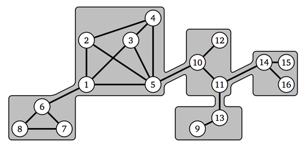

## 문제

창영 왕국의 왕 김상근은 왕국의 위대함을 널리 알리기 위해서 거대한 성을 건축하려고 한다. 성은 빌딩이 서로 연결된 형태이고, 빌딩은 홀과 홀을 연결하는 복도로 이루어져 있다.

처음에 성은 빌딩 하나로만 이루어져 있다. 이 빌딩은 메인 빌딩이라고 한다. 왕국의 인구가 증가할 때마다, 성은 다음과 같은 과정으로 확장된다.

새로운 부속 빌딩이 지어지면, 그 건물은 기존에 있던 빌딩과 연결된다. 새로 지어진 빌딩도 다른 빌딩과 마찬가지로 홀과 복도로 이루어져 있다. 또, 기존 건물의 홀과 새 건물의 홀을 연결하기 위해 새로운 복도를 만들어야 한다. 이 복도는 새 건물로 가는 유일한 통로이다.

한 빌딩에 있을 수 있는 홀의 최대 개수는 10개이다.

그림 1. 예제로 주어지는 성을 그림으로 나타낸 것.

요즘 상근이를 암살하려는 세력이 점점 커지고 있다. 상근이는 모든 홀에 전략적으로 경비원을 배치해서 모든 복도를 감시하게 하려고 한다. 상근이는 개인 경호원을 최대한 많이 데리고 있기를 원하기 때문에, 홀에 배치하는 경비원의 수는 최소로 하려고 한다. 얼마전에 성에 발생한 불로 인해서, 모든 홀과 복도 사이에는 문이 없다. 따라서, 경비원은 홀과 연결된 모든 복도를 감시할 수 있다.

## 입력

입력은 여러 개의 테스트 케이스로 이루어져 있다. 모든 홀는 1부터 10000까지의 숫자중 하나로 구분할 수 있다. 각 성은 재귀적으로 정의되어 있으며, 메인 빌딩부터 입력으로 주어진다.

테스트 케이스의 첫째 줄에는 메인 빌딩을 구성하고 있는 홀의 수 n (2 ≤ n ≤ 10), 복도의 수 m (1 ≤ m ≤ 45), 빌딩과 연결된 빌딩의 수 w (0 ≤ w ≤ 10)가 주어진다.

다음 줄부터 m개 줄에는 복도의 정보가 주어지며, 복도가 연결하는 홀의 번호가 주어진다. 두 홀은 항상 같은 빌딩안에 있다.

다음 w개 줄에는 다른 빌딩과 연결하는 복도의 정보가 주어진다. 복도의 정보는 두 숫자로 이루어져 있고, 현재 빌딩의 홀의 번호와 연결된 빌딩의 홀의 번호가 주어진다. 각 복도의 정보가 주어진 다음에는 연결된 빌딩의 정보가 메인 빌딩의 정보와 같은 형식으로 주어진다. (재귀적으로 주어지는 것이다. 빌딩의 정보가 주어진 후에는 다음에 연결된 빌딩의 정보가 주어지는 것이다. 마찬가지로, 연결된 빌딩의 정보가 주어지다가, 다시 그 건물과 연결된 빌딩의 정보가 주어지는 것이다. 즉, 성은 트리 구조라고 생각하면 된다)

성은 항상 모두 연결되어 있다. 즉, 각 홀은 다른 홀과 직접 또는 다른 홀을 통해서 연결되어져 있다. 같은 홀을 연결하는 복도(연결하는 홀의 번호가 같은 복도)는 존재하지 않으며, 두 홀 사이에 있을 수 있는 복도의 수는 최대 한 개이다.

## 출력

각각의 테스트 케이스에 대해서, 모든 복도를 감시하는데 필요한 경비원의 수의 최솟값을 출력한다.
