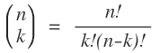

## 문제

창영이와 강산이는 이항계수를 좋아한다. 창영이와 강산이는 집 방향이 같기 때문에, 같이 지하철을 타고 이항계수 맞추기 게임을 하면서 등하교를 한다.

이항계수는 n개의 서로 다른 물건 중에서 순서 없이 k개를 뽑는 조합의 가짓수이고, 다음과 같이 정의된다.

이항계수 게임은 창영이가 어떤 정수 m을 말하면, 강산이는 결과가 m인 n과 k를 생각한 뒤, 그것을 말하는 방식으로 이루어진다. 예를 들어, 창영이가 15라고 말했다면, 강산이는 (6,2), (6,4), (15,1), (15,14)를 말하면 된다.

창영이는 집에서 미리 이항계수를 계산해보고 나오기 때문에, 결과가 m인 이항계수는 적어도 하나 있다.

## 입력

첫째 줄에 m이 주어진다. (2 ≤ m ≤ 1015)

## 출력

첫째 줄에 결과가 m인 이항 계수의 개수를 출력한다. 다음줄부터 한 줄에 하나씩 n,k 쌍을 출력한다. 출력하는 순서는 n이 증가하는 순서, 같을 경우에는 k가 증가하는 순서대로 출력한다.
