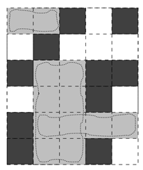

## 문제

As you may know, the country of Absurdistan is full of abnormalities. For example, the whole country can be divided into unit squares that are either grass or swamp. Also, the country is famous for its incapable bureaucrats. If you want to buy a piece of land (called a parcel), you can only buy a rectangular area, because they cannot handle other shapes. The price of the parcel is determined by them and is proportional to the perimeter of the parcel, since the bureaucrats are unable to multiply integers and thus cannot calculate the area of the parcel.

Per owns a parcel in Absurdistan surrounded by swamp and he wants to sell it, possibly in parts, to some buyers. When he sells a rectangular part of his land, he is obliged to announce this to the local bureaucrats. They will first tell him the price he is supposed to sell it for. Then they will write down the name of the new owner and the coordinates of the south-east corner of the parcel being sold. If somebody else already owns a parcel with a south-east corner at the same spot, the bureaucrats will deny the change of ownership.

Per realizes that he can easily trick the system. He can sell overlapping areas, because bureaucrats only check whether the south-east corners are identical. However, nobody wants to buy a parcel containing swamp.

In this example, dark squares represent swamp. Per may, for example, sell three overlapping grey areas, with dimensions 2 × 1, 2 × 4 and 4 × 1 respectively. The total perimeter is 6 + 12 + 10 = 28. Note that he can get more money by selling even more land. This figure corresponds to the case in the sample input.

Now Per would like to know how many parcels of each perimeter he needs to sell in order to maximize his profit. Can you help him? You may assume that he can always find a buyer for each piece of land, as long as it doesn’t contain any swamps. Also, Per is sure that no square within his parcel is owned by somebody else.

## 입력

On the first line a positive integer: the number of test cases, at most 100. After that per test case:

* One line with two integers n and m (1 ≤ n, m ≤ 1 000): the dimensions of Per’s parcel.
* n lines, each with m characters. Each character is either ‘#’ or ‘.’. The j-th character on the i-th line is a ‘#’ if position (i, j) is a swamp, and ‘.’ if it is grass. The north-west corner of Per’s parcel has coordinates (1, 1), and the south-east corner has coordinates (n, m).

## 출력

Per test case:

* Zero or more lines containing a complete list of how many parcels of each perimeter Per needs to sell in order to maximize his profit. More specifically, if Per should sell pi parcels of perimeter i in the optimal solution, output a single line “pi x i”. The lines should be sorted in increasing order of i. No two lines should have the same value of i, and you should not output lines with pi = 0.
