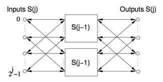
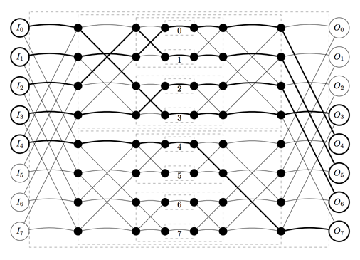

## 문제

A telephone company wants to build a new telephone network in a city. The company has the goal that each person in the city should be able to call each other person. Of course, it is not possible to build direct connections between every pair of persons. Instead, the company uses a network made up of several layers.

We denote a network switch in layer j by S(j). A switch S(0) consists of one input, one output and a cable connecting the input to the output. A switch S(j) with j > 0 consists of 2j inputs, 2j outputs and two switches S(j - 1). Input i of S(j) (0 ≤ i < 2j) is connected via a cable to the inputs i mod 2j-1 of each of the two switches S(j - 1). Similarly, output i of S(j) is connected to the outputs i mod 2j-1 of each of the two switches S(j - 1).

The connections between a switch S(j) and the two switches S(j - 1) it consists of.

We are considering a network with one switch S(n) in the outermost layer. It can be shown that any input and output of switch S(n) has a unique connection path to any of the S(0) switches. Therefore, any input of S(n) can be connected to any of its outputs, and the connection path is uniquely determined by specifying through which switch S(0) the connection is established.

We number the switches S(0) belonging to the switch S(n) from 0 to 2n - 1. The i-th switch S(0) is defined as follows. Write the number i in binary as bn-1bn-2...b0. This defines a path from an input of S(n) to the i-th switch S(0) via the following procedure: for each j, bj = 0 indicates that the path extends from S(j + 1) to the first S(j) switch to which it is directly connected, and bj = 1 indicates that the path extends to the second S(j) switch. Note that regardless of which input of S(n) is selected, this path arrives at the same S(0) switch, which is given the number i. See also the figure below the sample data for details of how the numbering works.

Sometimes multiple connections are needed at the same time. In order to avoid interference, each of the inputs and outputs of all switches S(j) (0 ≤ j ≤ n) can be used by at most one connection. Given a set of connection requests, can you find connection paths for each request such that the connection paths are disjoint?

## 입력

On the first line a positive integer: the number of test cases, at most 100. After that per test case:

* One line with two integers n (1 ≤ n ≤ 16) and m (1 ≤ m ≤ 2n): the layer of the outermost switch and the number of connection requests.
* m lines, each with two integers ai and bi (0 ≤ ai, bi < 2n). Each such line represents a connection request from input number ai of S(n) to output number bi. You may assume that the integers ai are pairwise distinct, and the integers bi are pairwise distinct as well.

## 출력

Per test case:

* One line with m integers s1, . . . , sm, where si is the number of the S(0) switch through which the connection of input ai to output bi is established.

The connection paths should be disjoint. You may print any valid solution, and you may assume that there is at least one valid solution.

## 힌트

A possible connection scheme for the second sample case, with used cables in bold.
