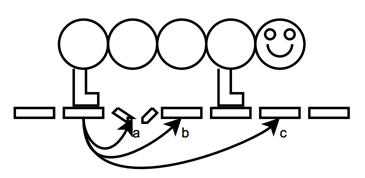

## 문제

Jonly is writing his first computer game. For the opening scene he wants to have the main character, Wormly, cross Bridgely, the bridge. Wormly is a worm made of b equal circular bubbles and l legs. At all times each leg has to be under one of the bubbles, and under each bubble there can be at most one leg. Bridgely was supposed to be composed of n planks with the width of each plank equal to the diameter of each of Wormly’s bubbles. However, some of the planks are missing.

At every moment, Wormly can do exactly one of the following:

Move one of its legs forward over any number of (possibly missing) planks. After the move, the leg should be on a plank and underneath one of Wormly’s bubbles. A leg isn’t allowed to overtake other legs.  
Move all of its bubbles forward one plank while its legs remain on the same planks. After the move each leg must still be under one of Wormly’s bubbles.

In this example, the only possible move for the last leg is to position b. (The plank at position a is missing, so the leg cannot move there. To get to position c, the last leg would have to overtake the first leg.) Also, in this example, moving all the bubbles forward is not allowed because Wormly’s last leg would end up without a bubble over it.

Now Jonly is wondering how long the animation takes until Wormly reaches the end of Bridgely. Initially Wormly’s bubbles are directly above the leftmost b planks of the bridge and its legs are on the leftmost l planks. At the end of the animation Wormly’s bubbles have to be directly above the rightmost b planks and its legs have to be on the rightmost l planks.

The left- and rightmost l planks of Bridgely are not missing.

## 입력

On the first line a positive integer: the number of test cases, at most 100. After that per test case:

* One line with three integers l, b and n (1 ≤ l ≤ b ≤ n ≤ 1 000 000): the number of legs, the number of bubbles and the length of the bridge respectively.
* One line with a string consisting of n characters, either ‘0’ or ‘1’, describing Bridgely. A one indicates a plank and a zero indicates a missing plank.

## 출력

Per test case:

* One line with an integer: the minimum number of steps it takes Wormly to cross Bridgely. If it is impossible to get across while satisfying the constraints, the line must contain “IMPOSSIBLE” instead.
