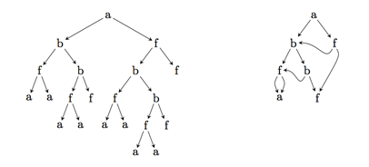

## 문제

Let the set Σ consist of all words composed of 1–4 lower case letters, such as the words “a”, “b”, “f”, “aa”, “fun” and “kvqf”. Consider expressions according to the grammar with the two rules

* E -> f
* E -> f(E,E)

for every symbol f ∈ Σ. Any expression can easily be represented as a tree according to its syntax. For example, the expression “a(b(f(a,a),b(f(a,a),f)),f(b(f(a,a),b(f(a,a),f)),f))” is represented by the tree on the left in the following figure:

Last night you dreamt of a great invention which considerably reduces the size of the representation: use a graph instead of a tree, to share common subexpressions. For example, the expression above can be represented by the graph on the right in the figure. While the tree contains 21 nodes, the graph just contains 7 nodes.

Since the tree on the left in the figure is also a graph, the representation using graphs is not necessarily unique. Given an expression, find a graph representing the expression with as few nodes as possible!

## 입력

The first line of the input contains the number c (1 ≤ c ≤ 200), the number of expressions. Each of the following c lines contains an expression according to the given syntax, without any whitespace. Its tree representation contains at most 50 000 nodes.

## 출력

For each expression, print a single line containing a graph representation with as few nodes as possible.

The graph representation is written down as a string by replacing the appropriate subexpressions with numbers. Each number points to the root node of the subexpression which should be inserted at that position. Nodes are numbered sequentially, starting with 1; this numbering includes just the nodes of the graph (not those which have been replaced by numbers). Numbers must point to nodes written down before (no forward pointers). For our example, we obtain “a(b(f(a,4),b(3,f)),f(2,6))”.
