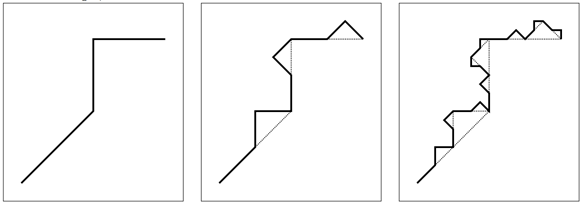

## 문제

Fractals are really cool mathematical objects. They have a lot of interesting properties, often including:

fine structure at arbitrarily small scales;  
self-similarity, i.e., magnified it looks like a copy of itself;  
a simple, recursive definition.

Approximate fractals are found a lot in nature, for example, in structures such as clouds, snow flakes, mountain ranges, and river networks.

In this problem, we consider fractals generated by the following algorithm: we start with a polyline, i.e., a set of connected line segments. This is what we call a fractal of depth one (see leftmost picture). To obtain a fractal of depth two, we replace each line segment with a scaled and rotated version of the original polyline (see middle picture). By repetitively replacing the line segments with the polyline, we obtain fractals of arbitrary depth and very fine structures arise. The rightmost picture shows a fractal of depth three.

The complexity of an approximate fractal increases quickly as its depth increases. We want to know where we end up after traversing a certain fraction of its length.

## 입력

The input starts with a single number c (1 ≤ c ≤ 200) on one line, the number of test cases. Then each test case starts with one line with n (3 ≤ n ≤ 100), the number of points of the polyline. Then follow n lines with on the ith line two integers xi and yi (−1 000 ≤ xi , yi ≤ 1 000), the consecutive points of the polyline. Next follows one line with an integer d (1 ≤ d ≤ 10), the depth of the fractal. Finally, there is one line with a floating point number f (0 ≤ f ≤ 1), the fraction of the length that is traversed.

The length of each line segment of the polyline is smaller than the distance between the first point (x1, y1) and the last point (xn, yn) of the polyline. The length of the complete polyline is smaller than twice this distance.

## 출력

Per test case, the output contains one line with the coordinate where we end up. Format it as (x,y), with two floating point numbers x and y. The absolute error in both coordinates should be smaller than 10−6.
